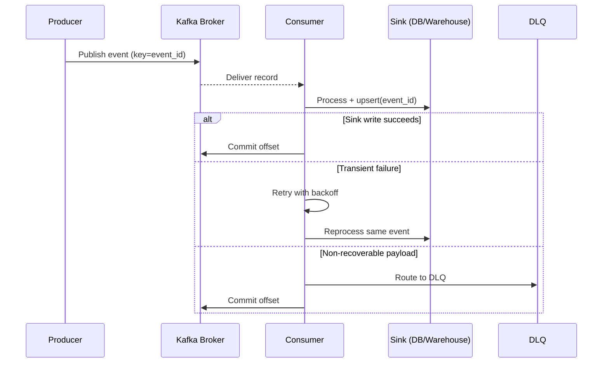
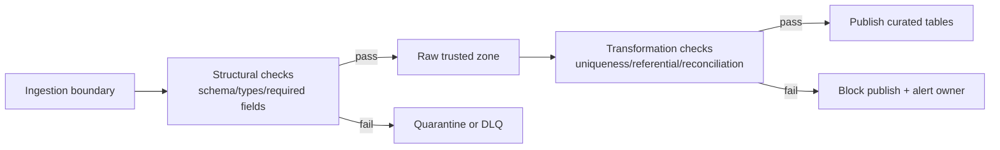
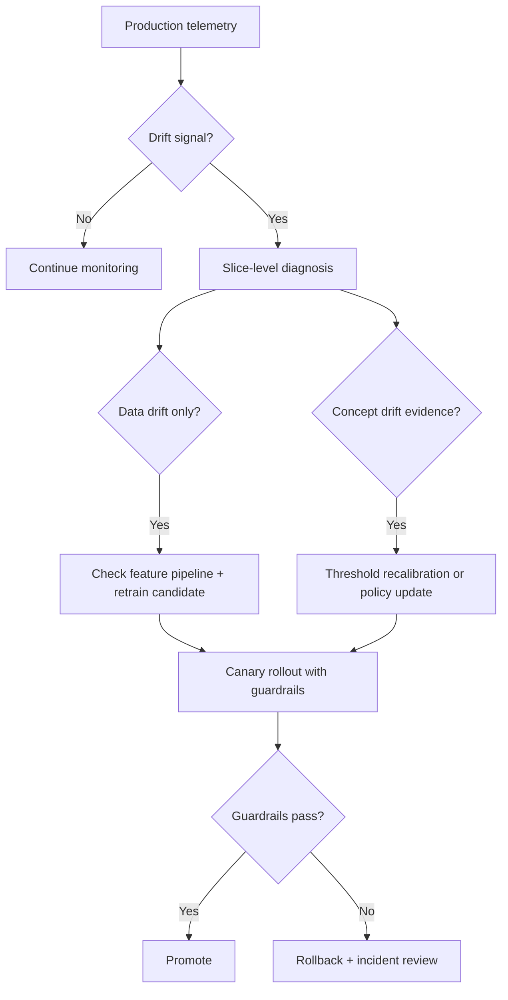
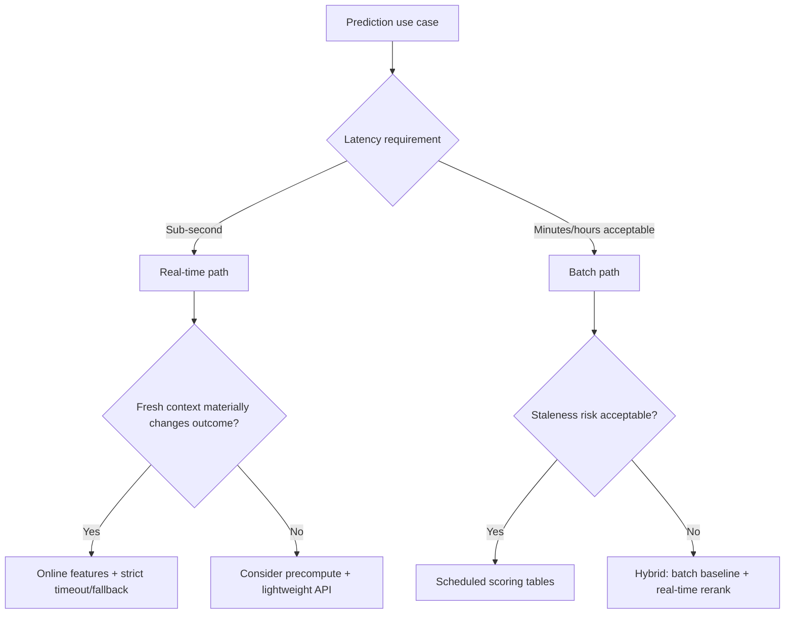
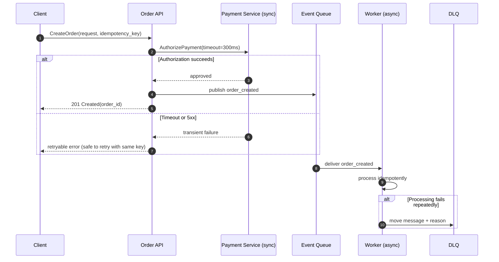
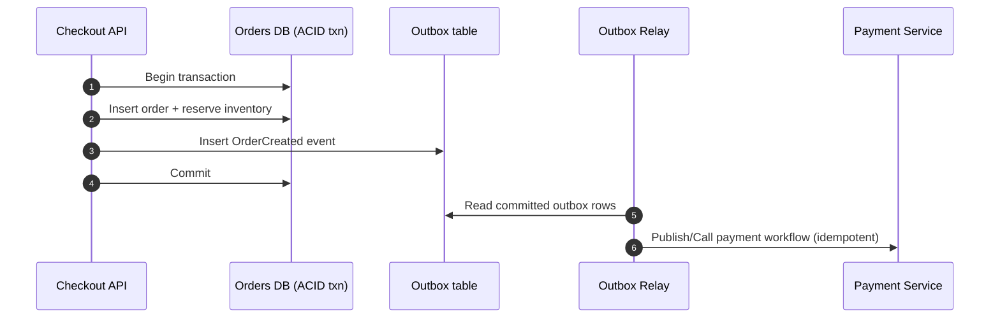

# Software Engineering Study Guide
## Legend
### Data Engineer
**Core Topics**
#### Data Modeling and Warehousing
- [Dimensional Modeling vs Normalized Models](#ref-dimensional-modeling-vs-normalized-models)
- [Fact/Dimension Design Trade-Offs](#ref-fact-dimension-design-trade-offs)
- [Partitioning, Clustering, and Storage Layout Strategy](#ref-partitioning-clustering-and-storage-layout-strategy)
#### Airflow and Orchestration
- [DAG design for reliability and idempotency](#ref-dag-design-for-reliability-and-idempotency)
- [Backfills, retries, SLAs, and failure recovery](#ref-backfills-retries-slas-and-failure-recovery)
- [Dependency management and observability](#ref-dependency-management-and-observability)
#### Batch and Streaming (Apache Beam / Spark)
- [Event time vs processing time, windowing, and late data](#ref-event-time-vs-processing-time-windowing-and-late-data)
- [Exactly-once vs at-least-once guarantees](#ref-exactly-once-vs-at-least-once-guarantees)
- [Pipeline performance tuning and cost optimization](#ref-pipeline-performance-tuning-and-cost-optimization)
#### Kafka and Event-Driven Architecture
- [Topic/partition design and keying strategy](#ref-topic-partition-design-and-keying-strategy)
- [Consumer groups, rebalancing, and lag management](#ref-consumer-groups-rebalancing-and-lag-management)
- [Delivery guarantees, ordering, and schema evolution](#ref-delivery-guarantees-ordering-and-schema-evolution)
#### Debugging and Monitoring Production Systems
- [Golden signals (latency, errors, throughput, saturation)](#ref-golden-signals-latency-errors-throughput-saturation)
- [End-to-end tracing across pipelines and services](#ref-end-to-end-tracing-across-pipelines-and-services)
- [Runbooks, on-call triage, and incident postmortems](#ref-runbooks-on-call-triage-and-incident-postmortems)
#### Storage and Query Performance
- [Columnar formats and compression (Parquet, ORC)](#ref-columnar-formats-and-compression-parquet-orc)
- [Query planning basics (partition pruning and predicate pushdown)](#ref-query-planning-basics-partition-pruning-and-predicate-pushdown)
- [Cost/performance tuning in warehouse engines](#ref-cost-performance-tuning-in-warehouse-engines)
#### Data Quality and Governance
- [Data contracts and schema evolution](#ref-data-contracts-and-schema-evolution)
- [Validation at ingestion and transformation layers](#ref-validation-at-ingestion-and-transformation-layers)
- [Lineage, ownership, and incident response](#ref-lineage-ownership-and-incident-response)
### ML Engineer
**Core Topics**
#### Feature and Training Pipelines
- [Offline/Online Feature Consistency](#ref-offline-online-feature-consistency)
- [Data Leakage Prevention and Reproducible Training](#ref-data-leakage-prevention-and-reproducible-training)
- [Versioning for Data, Models, and Experiments](#ref-versioning-for-data-models-and-experiments)
#### Model Evaluation and Experimentation
- [Metric Selection Aligned to Business Goals](#ref-metric-selection-aligned-to-business-goals)
- [Bias/Variance Diagnosis and Error Analysis](#ref-bias-variance-diagnosis-and-error-analysis)
- [A/B Testing and Rollout Strategies](#ref-a-b-testing-and-rollout-strategies)
#### Debugging and Monitoring (ML)
- [Drift Detection (Data Drift and Concept Drift)](#ref-drift-detection-data-drift-and-concept-drift)
- [Production Metrics (Latency, Throughput, and Quality)](#ref-production-metrics-latency-throughput-and-quality)
- [Alerting and Root-Cause Analysis Workflow](#ref-alerting-and-root-cause-analysis-workflow)
#### ML System Design
- [Real-time vs batch inference architecture](#ref-real-time-vs-batch-inference-architecture)
- [Serving patterns (online APIs and batch scoring)](#ref-serving-patterns-online-apis-and-batch-scoring)
- [Retraining triggers and model lifecycle management](#ref-retraining-triggers-and-model-lifecycle-management)
#### LLM and Agent Systems
- [Prompt design, tool use, and function-calling reliability](#ref-prompt-design-tool-use-and-function-calling-reliability)
- [RAG fundamentals (retrieval quality, chunking, grounding)](#ref-rag-fundamentals-retrieval-quality-chunking-grounding)
- [Agent orchestration (planning, memory, failure recovery)](#ref-agent-orchestration-planning-memory-failure-recovery)
#### Inference Performance and Reliability
- [P95/P99 latency optimization (batching, caching, model size trade-offs)](#ref-p95-p99-latency-optimization-batching-caching-model-size-trade-offs)
- [Throughput vs quality trade-offs under load](#ref-throughput-vs-quality-trade-offs-under-load)
- [Safe fallback behavior when model/tool calls fail](#ref-safe-fallback-behavior-when-model-tool-calls-fail)
### Software Engineer
**Core Topics**
#### Backend Architecture Patterns
- [Service decomposition (monolith vs microservices trade-offs)](#ref-service-decomposition-monolith-vs-microservices-trade-offs)
- [Sync vs async boundaries (RPC, events, queues)](#ref-sync-vs-async-boundaries-rpc-events-queues)
- [Stateful vs stateless services and scaling implications](#ref-stateful-vs-stateless-services-and-scaling-implications)
#### Scale and Reliability Design
- [Traffic shaping (load balancing, rate limiting, backpressure)](#ref-traffic-shaping-load-balancing-rate-limiting-backpressure)
- [Multi-layer caching strategy (client, edge, application, data)](#ref-multi-layer-caching-strategy-client-edge-application-data)
- [Resilience patterns (timeouts, retries, circuit breakers, fallbacks)](#ref-resilience-patterns-timeouts-retries-circuit-breakers-fallbacks)
#### Distributed Systems Fundamentals
- [Consistency Models and CAP Implications](#ref-consistency-models-and-cap-implications)
- [Idempotency, Retries, and Failure Handling](#ref-idempotency-retries-and-failure-handling)
- [Backpressure and Graceful Degradation](#ref-backpressure-and-graceful-degradation)
#### API and Service Design
- [Versioning, pagination, and contract evolution](#ref-versioning-pagination-and-contract-evolution)
- [Authn/authz fundamentals and secure defaults](#ref-authn-authz-fundamentals-and-secure-defaults)
- [Observability (logs, metrics, traces, SLOs)](#ref-observability-logs-metrics-traces-slos)
#### Data Layer and Consistency Patterns
- [Transaction boundaries and isolation trade-offs](#ref-transaction-boundaries-and-isolation-trade-offs)
- [Read/write patterns (CQRS basics, eventual consistency implications)](#ref-read-write-patterns-cqrs-basics-eventual-consistency-implications)
- [Schema evolution and zero-downtime migrations](#ref-schema-evolution-and-zero-downtime-migrations)
#### Senior Engineering Leadership
- [Technical decision-making and RFC/ADR communication](#ref-technical-decision-making-and-rfc-adr-communication)
- [Cross-team collaboration and dependency planning](#ref-cross-team-collaboration-and-dependency-planning)
- [Mentoring, code review quality, and execution ownership](#ref-mentoring-code-review-quality-and-execution-ownership)
## Reference

## Data Engineer

### Data Modeling and Warehousing

#### Dimensional Modeling vs Normalized Models
Dimensional models are usually built for [**OLAP**](#olap) workloads, where the priority is fast aggregations and predictable query patterns over historical data. A star schema uses one central fact table joined to multiple dimension tables, which keeps BI queries simple and lowers the number of joins analysts must reason about. In contrast, normalized schema design is the default for [**OLTP**](#oltp) systems, where frequent updates and transactional correctness matter more than read convenience. [**Normalization**](#normalization) reduces duplication and update anomalies, but analytical queries often become join-heavy and harder to optimize at scale. A useful mental model is that dimensional design optimizes for consumption, while normalized design optimizes for write integrity and operational consistency. Many mature platforms combine both patterns: normalized operational systems feed dimensional warehouse models through ETL or ELT pipelines.

**Example scenarios**

- For an orders analytics dashboard with questions like "revenue by region by month," a star schema (fact_orders + dim_customer + dim_date) is usually easier and faster.
- For a checkout system that updates inventory and payment state in real time, a normalized schema is safer because each business entity has a single source of truth.

**Interview Q&A**

- **Q:** When would you avoid a star schema?
- **A:** A team should avoid a star schema in write-heavy transactional paths where update consistency matters more than analytical query simplicity.
- **Q:** Can one company use both models?
- **A:** Yes. A common architecture is normalized OLTP systems feeding a dimensional warehouse for analytics.

#### Fact/Dimension Design Trade-Offs
Fact and dimension design starts by declaring table grain, which means the exact business event each fact row represents and cannot represent more than once. Teams usually prefer the lowest practical grain because coarse-grained tables permanently remove detail needed for later analysis. Once grain is fixed, dimension strategy determines how attribute changes are handled through slowly changing dimensions (SCD). [**SCD Type 1 vs Type 2**](#scd-type-1-vs-type-2) is a business decision, not only a technical one: Type 1 rewrites history for "current truth," while Type 2 preserves historical truth for audits and trend analysis. Designers should also state whether measures are additive, semi-additive, or non-additive so reporting teams avoid invalid aggregations. [**Denormalization**](#denormalization) is then applied deliberately to reduce query complexity, while acknowledging higher storage use and stricter data-quality expectations in pipelines.

**Example scenarios**

- If a product team asks for "daily revenue by category," table grain at one row per order item keeps future analysis flexible, including returns and discounts.
- If customer region changes should preserve history for past reports, use SCD Type 2 so old rows still map to the historical region at that time.

**Interview Q&A**

- **Q:** How do you pick fact table grain?
- **A:** The recommended approach is to choose the lowest practical grain that supports core business questions without creating unnecessary storage or compute cost.
- **Q:** When do you use SCD Type 1 vs Type 2?
- **A:** Type 1 when history is not needed; Type 2 when historical reporting must remain accurate after attribute changes.

#### Partitioning, Clustering, and Storage Layout Strategy
Partitioning controls coarse-grained data skipping, so partition keys should align with common high-level filters such as business date or ingestion date. [**Partition pruning**](#partition-pruning) is the optimization where the engine skips entire partitions that cannot match query predicates, which reduces scanned bytes and cost. Clustering adds fine-grained organization within partitions (or micro-partitions), improving predicate selectivity for repeatedly filtered fields such as customer_id or region. Bad key choices create skew, where work distribution becomes uneven, and can lead to hot partitions with unstable latency under load. Over-partitioning creates too many small files and high metadata overhead, so practical designs balance pruning benefits against operational complexity. Sustainable layouts include periodic compaction, query-pattern reviews, and updates as workloads evolve.

**Example scenarios**

- A clickstream table partitioned by event_date can skip most data for time-bounded queries like "last 7 days."
- Clustering by customer_id helps queries that repeatedly filter on customer-level activity, especially in large partitions.

**Interview Q&A**

- **Q:** Why not partition by a high cardinality field like user_id?
- **A:** High-cardinality means there are many distinct values, which can create too many tiny partitions and high metadata overhead.
- **Q:** What signs indicate poor partition strategy?
- **A:** Frequent full scans, skewed task runtimes, and many small files are common signs the layout should be redesigned.

### Airflow and Orchestration

#### DAG design for reliability and idempotency
In Airflow, a DAG (Directed Acyclic Graph, a workflow of ordered tasks) should express deterministic task boundaries so each run is reproducible and operationally debuggable. Senior-level design starts with idempotent tasks, which means rerunning a failed or partially completed step converges to the same final dataset instead of producing duplicates. This usually requires explicit write semantics such as partition overwrite, merge-on-key, or deduplication keyed by a stable business identifier. Reliability also improves when tasks are small, have clear ownership, and fail fast on bad assumptions rather than silently continuing with partial data. Teams should avoid embedding non-deterministic logic tied to wall-clock timing unless that timing is part of declared business behavior. A strong DAG contract defines inputs, outputs, and data-quality assertions so retries and reruns are safe by construction.

**Example scenarios**

- A daily fact_orders load writes to dt=2026-03-24 using an atomic overwrite, so a retry after warehouse timeout does not duplicate rows.
- A webhook-ingestion DAG uses event_id as a deduplication key before persistence, so replayed events from upstream outage recovery remain correct.

**Interview Q&A**

- **Q:** How do you make an Airflow task idempotent when loading warehouse tables?
- **A:** The practical approach is to design writes around stable keys and deterministic partitions, then enforce merge/overwrite semantics instead of blind appends. I also add row-count or uniqueness checks so a rerun validates output correctness, not only task success.
- **Q:** What is a common anti-pattern in DAG reliability design?
- **A:** A common anti-pattern is a task that appends results without deduplication and also depends on execution-time side effects. That pattern turns retries into data corruption events, which is exactly what orchestration should prevent.

#### Backfills, retries, SLAs, and failure recovery
Backfills should be treated as controlled production changes because they often stress data stores, violate normal dependency timing, and expose latent pipeline assumptions. A safe strategy defines backfill scope up front, including date ranges, concurrency caps, and whether downstream consumers should be paused or isolated. Retry policy should match failure mode: transient infrastructure errors get bounded exponential retries, while deterministic data errors should fail immediately and route to operators. SLA (Service Level Agreement) handling needs explicit ownership, with alerting and escalation paths tied to business impact rather than only technical symptoms. Failure recovery is strongest when teams codify rollback or replay decisions in runbooks and avoid ad hoc manual fixes during incidents. Senior practitioners also rehearse backfill and recovery workflows in lower environments so high-pressure production incidents are procedural rather than improvisational.

**Example scenarios**

- A 90-day historical backfill runs in 3-day chunks with max active runs limited to protect warehouse concurrency for interactive analytics users.
- A task that fails from malformed partner data is configured with zero retries and automatic paging, while transient network failures get two exponential retries.

**Interview Q&A**

- **Q:** How do you decide retry count and delay in Airflow?
- **A:** I classify failures first: transient failures get small bounded retries with backoff and jitter, but deterministic failures should fail fast to avoid retry storms and wasted compute. The exact values come from dependency SLOs and downstream tolerance for delay.
- **Q:** What makes backfills risky in mature platforms?
- **A:** Backfills can unexpectedly contend with live workloads, trigger downstream reprocessing, and surface schema or logic drift that did not matter in forward-only runs. Without clear scope, throttling, and communication, they can create broad incident blast radius.

#### Dependency management and observability
Dependency management in orchestration should model data readiness, not only task completion order, because a technically successful upstream run can still produce unusable outputs. A mature DAG separates dependency types: upstream compute dependencies, external system dependencies, and data-quality dependencies, each with explicit pass or fail criteria and owners. Observability then makes those decisions operational by combining freshness, volume, failure-rate, and latency signals into alerts that map directly to responder actions. The most important shift at senior level is to instrument for diagnosis, not just detection: alerts should answer what is broken and who acts next within minutes. Teams also define suppression and escalation rules so noisy conditions do not hide high-impact incidents. When dependency contracts and observability are aligned, on-call response becomes a controlled decision process instead of log-driven guesswork.

**Example scenarios**

- A downstream publish step depends on upstream completion and a uniqueness check on primary keys; when duplicates exceed threshold, publication is blocked and routed to the owning pipeline team.
- A late-arrival incident shows normal task success but degraded freshness; alerts trigger on freshness SLO breach and point directly to a slow upstream API dependency rather than the orchestration layer.

**Interview Q&A**

- **Q:** What is a common failure mode when teams treat dependencies as task-order only?
- **A:** They propagate bad data that is on time but incorrect, because ordering guarantees execution sequence, not semantic correctness. Senior designs gate critical handoffs on data-quality conditions and ownership-aware escalation.
- **Q:** How do you reduce alert noise without losing detection quality?
- **A:** Use tiered alerts tied to business impact, deduplicate repeated symptoms, and require each paging alert to have an explicit runbook action. If an alert does not change operator behavior, it should be redesigned or removed.

### Batch and Streaming (Apache Beam / Spark)

#### Event time vs processing time, windowing, and late data
In distributed stream processing, event time is when an event actually occurred in the source system, while processing time is when the engine observes and computes on that event. Senior engineers prefer event-time semantics for business metrics because ingestion delays, retries, and regional outages can reorder arrival without changing business reality. Windowing defines bounded slices of time, such as tumbling or sliding windows, so continuous streams can produce finite aggregations for reporting and alerting. Watermarks estimate how complete event-time data is up to a timestamp and allow the system to close windows with explicit late-data tolerance rather than waiting forever. Late-data policy is a product decision as much as a technical one, since aggressive finalization reduces latency but can undercount when upstream systems are bursty. In Beam and Spark Structured Streaming, robust designs expose allowed lateness and correction behavior clearly so downstream consumers know whether outputs are provisional or final.

**Example scenarios**

- A payments risk pipeline computes 5-minute fraud aggregates by event time, not ingestion time, so temporary network delays do not shift suspicious activity into the wrong interval.
- A mobile analytics stream sets a 10-minute watermark and allows updates to already emitted windows, trading slightly more downstream complexity for materially better count accuracy during offline-device reconnect bursts.

**Interview Q&A**

- **Q:** Why is processing-time windowing risky for KPI reporting?
- **A:** Processing-time windows can misclassify events whenever ingest latency varies, which makes trend lines reflect infrastructure behavior instead of user behavior. Event-time windows with watermarks preserve business semantics under delay and reordering.
- **Q:** How do you choose allowed lateness in production?
- **A:** Start from observed event-delay distribution and business tolerance for revisions, then pick a lateness threshold that captures most delayed events without violating freshness SLOs. Revisit it periodically as upstream traffic patterns change.

#### Exactly-once vs at-least-once guarantees
Delivery guarantees should be analyzed end-to-end, because local exactly-once processing inside Beam or Spark does not automatically produce globally exactly-once business outcomes. At-least-once means records may be reprocessed, so correctness depends on idempotency and deterministic state transitions at sinks. Practical exactly-once in real systems usually combines transactional or deduplicated writes, checkpointed progress, and replay-safe key design rather than trusting a single framework flag. Senior candidates should explain failure boundaries explicitly: broker redelivery, task retry, state restore, and sink commit semantics each affect duplicate risk differently. When true exactly-once is too expensive, teams often choose at-least-once plus bounded duplicate reconciliation because it gives better throughput and lower operational fragility. The key interview signal is whether you can map guarantee language to concrete failure modes and controls, not just recite definitions.

**Example scenarios**

- A clickstream enrichment job runs at-least-once but writes to a warehouse table with merge-on event_id, so retries are safe and duplicate events collapse deterministically.
- A financial ledger stream uses transactional sink commits and strict deduplication keys to meet audit requirements where even a single duplicate posting is unacceptable.

**Interview Q&A**

- **Q:** Can a pipeline be exactly-once if the sink is append-only with no dedup logic?
- **A:** No for end-to-end semantics. Even if compute state is recovered exactly once, retries and redelivery can still create duplicate business records without idempotent sink behavior.
- **Q:** When is at-least-once the right choice?
- **A:** It is often the right choice when low latency and high throughput matter more than strict no-duplicate guarantees, provided downstream storage enforces idempotent upserts or periodic reconciliation.

#### Pipeline performance tuning and cost optimization
Most distributed data pipeline cost and latency regressions come from a small set of physical behaviors: excessive [**shuffle**](#shuffle), severe [**skew**](#skew), and poorly sized partitions that create long-tail stages. Effective tuning starts by identifying the dominant expensive stage, then changing one lever at a time (pre-aggregation, join strategy, partition sizing, caching, or key redesign) and validating both runtime and correctness. Teams should optimize for end-to-end SLO compliance, not stage-level microbenchmarks, because local wins can move bottlenecks downstream or increase failure risk. Cost optimization is strongest when compute shape matches workload shape: steady streaming paths should be provisioned differently from bursty backfills and ad hoc heavy jobs. Senior engineers also treat retries and data reprocessing as cost multipliers, so reliability improvements often save as much money as raw compute tuning. The durable pattern is measurement-driven iteration with stable baselines, regression checks, and documented rollback criteria.

**Example scenarios**

- A Spark job with a wide join on raw events is refactored to pre-aggregate by `customer_id` before join, reducing shuffle bytes by 60% and cutting both runtime and executor memory pressure.
- A streaming pipeline with hot keys isolates top-N keys into a separate path with controlled parallelism, removing tail-latency spikes and avoiding expensive cluster-wide overprovisioning.

**Interview Q&A**

- **Q:** What metrics do you check first when a pipeline suddenly slows down?
- **A:** I start with stage-level shuffle read/write, skew distribution, spill, and retry counts. Those usually reveal whether the issue is data movement, imbalance, memory pressure, or instability from repeated failures.
- **Q:** How do you ensure cost optimization does not degrade data correctness?
- **A:** Every performance change ships with output-parity checks and data-quality assertions on critical aggregates. Cost wins are only accepted if correctness invariants hold under replay and failure scenarios.

### Kafka and Event-Driven Architecture

#### Topic/partition design and keying strategy
Kafka topic design starts by mapping each topic to a stable business event boundary, then sizing partitions to balance parallelism, retention cost, and operational overhead. A partition is an ordered append-only log shard; Kafka guarantees ordering only within a single partition, not across all partitions in a topic. A message key determines which partition receives an event, so key choice directly controls both ordering guarantees and load distribution. Senior trade-off decisions usually involve choosing between strict per-entity ordering (for example, keying by order_id) and better throughput distribution (for example, keying by a less skewed key) when hot keys appear. Too few partitions limit consumer concurrency and future scale, while too many partitions increase broker metadata load, rebalance duration, and controller pressure. Topic boundaries should also reflect ownership and data lifecycle, because mixing unrelated domains into one topic makes schema evolution and access control harder over time.

**Example scenarios**

- An orders.events topic keys by order_id so all events for a single order stay ordered, which simplifies fulfillment state machines at the cost of potential hot partitions for very active orders.
- A high-volume telemetry topic uses a composite key like device_id + hour_bucket to reduce skew and improve throughput, accepting that strict per-device total ordering is partially relaxed.

**Interview Q&A**

- **Q:** How do you choose partition count for a new topic?
- **A:** Start from expected throughput, consumer parallelism targets, and retention horizon, then add headroom for growth because increasing partitions later can change key-to-partition mapping. I also evaluate operational limits such as broker count and rebalance blast radius, not just raw ingest rate.
- **Q:** Why can key choice become a production risk?
- **A:** A poorly distributed key creates hot partitions, which means uneven consumer load, higher latency, and localized backlog even when total cluster capacity looks healthy. The right answer is often a trade-off between business ordering guarantees and even distribution.

#### Consumer groups, rebalancing, and lag management
A Kafka consumer group scales reads by assigning each partition to one consumer instance at a time, so throughput depends on partition count, assignment strategy, and downstream processing speed. A [**rebalance**](#rebalance) happens when group membership or partition metadata changes, and it can temporarily pause progress while ownership is reassigned. Senior engineers treat lag as a symptom, not a diagnosis: [**consumer lag**](#consumer-lag) can rise because of traffic bursts, slow handlers, poison messages, external dependency degradation, or repeated rebalances. The right mental model is to convert lag into time-to-drain and compare that against freshness [**SLO**](#slo), instead of judging by raw offset gap alone. Stability improves when teams combine cooperative rebalancing, static membership, bounded retries, and [**dead-letter queues**](#dead-letter-queue) for non-recoverable records. Strong designs also coordinate autoscaling with downstream limits, because adding consumers without controlling dependency load can reduce lag briefly while increasing error amplification and incident duration.

**Example scenarios**

- During a promotion spike, lag grows quickly but consumers are healthy; the team computes drain time, confirms SLO risk, scales consumers within partition limits, and temporarily relaxes non-critical enrichment to recover freshness.
- A single malformed payload repeatedly crashes one partition worker; after bounded retries, the record is routed to a DLQ, the partition resumes, and an alert opens an investigation workflow for producer-side fix.

**Interview Q&A**

- **Q:** What is your first step when lag jumps in production?
- **A:** I classify the failure mode before scaling: check rebalance frequency, per-partition lag distribution, consumer processing latency, and downstream dependency health. Then I choose a targeted mitigation (scale, isolate bad records, rate-limit, or rollback) based on the bottleneck.
- **Q:** Why can "just add consumers" be a bad response?
- **A:** If partitions are already fully assigned or downstream systems are saturated, extra consumers add churn without useful throughput. In the worst case, they increase rebalances and retry pressure, which worsens end-to-end delay.

#### Delivery guarantees, ordering, and schema evolution
Kafka guarantees are meaningful only when stated end-to-end as a [**data contract**](#data-contract), not as broker-only settings. At-least-once delivery means duplicates are expected under crash/retry paths, so correctness depends on sink idempotency via stable keys and deterministic upsert or dedup logic. "Exactly-once" should be framed precisely: idempotent producers and transactions can narrow duplicate windows, but business-level exactly-once still fails if external side effects are non-transactional or sinks are append-only without reconciliation. Ordering is partition-scoped, so requiring cross-entity global order is usually an architecture smell that should be replaced with per-entity sequencing plus reconciliation. [**Offset**](#offset) commit strategy is a core control point: commit after successful processing to protect replay safety, and make failure handling explicit for retries vs [**dead-letter queue**](#dead-letter-queue) routing. Schema evolution is safest when compatibility rules are enforced in registry plus CI, with staged rollouts that tolerate mixed producer/consumer versions and observable deserialization failures.

The delivery and recovery path is easier to reason about with a sequence view:

This sequence makes the failure boundaries explicit: duplicates are controlled by sink semantics and offset timing, not by a single broker setting.

**Example scenarios**

- A billing pipeline uses transactional producer writes and idempotent sink upserts keyed by event_id, commits offsets only after sink success, and can replay safely after consumer crashes.
- A team adds a required field by first shipping it as optional with defaults, verifies backward compatibility in CI, then tightens validation after all consumers upgrade.

**Interview Q&A**

- **Q:** What does a strong exactly-once answer sound like in a senior interview?
- **A:** It names concrete failure boundaries: producer retry, broker redelivery, consumer restart, sink commit, and external side effects. Then it explains which controls close each boundary and which duplicate risks remain.
- **Q:** How do you balance strict guarantees with throughput?
- **A:** I quantify business impact of duplicates vs latency/cost, then choose the lightest guarantee that still protects critical invariants. For many domains, at-least-once plus strong idempotent sinks is the best reliability/throughput trade-off.

### Debugging and Monitoring Production Systems

#### Golden signals (latency, errors, throughput, saturation)
The golden signals give a fast, shared language for production health, but they are only useful when thresholds map to user-facing impact instead of arbitrary infrastructure noise. Latency should be tracked at percentiles (for example P95 and P99) for critical paths because averages hide tail pain during incidents. Errors should be separated into expected and unexpected classes so alerting reflects broken behavior, not normal retries or client misuse. Throughput must be interpreted with capacity context, since a drop can indicate traffic loss just as much as a success-rate issue. Saturation (resource pressure such as CPU, memory, queue depth, or connection pools nearing limits) is the early warning signal for cascading failures and retry storms. Effective incident response pairs these four signals with service-level objectives so responders can decide whether to mitigate immediately, degrade non-critical features, or monitor while traffic normalizes.

**Example scenarios**

- Checkout P99 latency doubles while error rate is flat and database CPU is near 95%; on-call identifies saturation from a bad query plan and mitigates with a read-path feature flag before customer-visible failures spread.
- API throughput drops by 30% during peak traffic with stable infrastructure metrics; investigation finds a misconfigured edge rule blocking a region, so the team fixes routing instead of scaling compute.

**Interview Q&A**

- **Q:** Why are golden signals more useful than tracking dozens of internal metrics first?
- **A:** They compress incident detection into a few signals that correlate directly with user experience and system risk. You can still drill into internal metrics, but golden signals help prioritize where to look and what to protect first during triage.
- **Q:** How do you set alert thresholds without creating noise?
- **A:** Start from [**SLO**](#slo) boundaries and historical baseline variance, then alert on sustained breaches rather than one-off spikes. I also separate paging alerts from informational alerts so only clear user-impact conditions wake on-call.

#### End-to-end tracing across pipelines and services
End-to-end tracing turns a multi-system failure from guesswork into a navigable execution timeline by following a trace ID across services, queues, and batch or streaming jobs. The key design rule is propagation discipline: every boundary that receives a request or event must forward correlation identifiers and create spans with meaningful operation names. In data platforms, tracing is especially valuable at async boundaries where work is delayed or retried, because logs alone rarely show causal ordering across ingestion, transform, and serving stages. High-quality traces also include domain context (for example order_id, dataset partition, or workflow run id) so responders can map technical symptoms to business impact quickly. During incidents, tracing helps distinguish upstream delay from downstream bottleneck by showing where wall-clock time accumulates and where retries fan out. Mature teams combine tracing with logs and metrics so they can move from "where did it fail?" to "what changed, and what is the safest mitigation?" in one investigation loop.

**Example scenarios**

- A customer report request times out; distributed trace shows 70% of end-to-end time spent waiting on a feature-store call after a dependency release, so rollback is prioritized over app-server scaling.
- A late-data spike in a streaming pipeline is initially blamed on Kafka lag, but trace spans reveal the real delay is a downstream enrichment API with intermittent 429 responses and aggressive retries.

**Interview Q&A**

- **Q:** What is the most common reason distributed tracing fails during a real incident?
- **A:** Missing or inconsistent trace propagation at service boundaries, especially async handoffs, breaks the request chain and leaves partial timelines. I treat propagation as a contract and add automated checks in shared middleware or SDKs.
- **Q:** How is tracing different from centralized logging for root cause analysis?
- **A:** Logs show events, but traces preserve causal structure and timing across components. That structure is what lets you isolate bottlenecks, retry amplification, and dependency hotspots quickly under pressure.

#### Runbooks, on-call triage, and incident postmortems
Runbooks reduce cognitive load during incidents by converting known failure patterns into explicit diagnosis and mitigation steps with clear ownership. A strong on-call triage flow starts with impact assessment, then checks recent deploys and dependency health, then narrows to failing components using dashboards and traces before applying the safest mitigation. Good runbooks include decision points (for example when to page another team, when to fail over, when to disable a feature) rather than only command snippets. During active response, timeline discipline is critical: record what changed, when it changed, and why, so handoffs remain accurate and leadership updates are factual. Postmortems should be blameless and action-oriented, documenting root cause, contributing factors, detection gaps, customer impact, and concrete prevention items with owners and due dates. The practical goal is not only restoring service but increasing organizational reliability by ensuring the same failure mode becomes easier to detect, contain, and recover next time.

**Example scenarios**

- An ingestion outage begins after a schema rollout; triage runbook directs responders to pause downstream loads, restore previous schema version, and replay backlog once compatibility checks pass.
- A cache cluster incident causes elevated latency; incident commander follows escalation criteria in the runbook, triggers partial traffic shift, and records a minute-by-minute timeline that later exposes missing capacity alarms.

**Interview Q&A**

- **Q:** What separates a useful postmortem from a status report?
- **A:** A useful postmortem explains why controls failed and what systemic changes will prevent recurrence, not just what happened. It includes measurable follow-up actions, clear owners, and deadlines tied to risk reduction.
- **Q:** How do you keep on-call triage fast when information is incomplete?
- **A:** Use a fixed triage sequence focused on impact and reversible mitigations first, then deepen diagnosis after stabilization. This prevents analysis paralysis and limits blast radius while evidence is still being gathered.

### Storage and Query Performance

#### Columnar formats and compression (Parquet, ORC)
Columnar formats such as Parquet and ORC store values by column instead of by row, which allows warehouse engines to read only the columns needed by a query and avoid unnecessary I/O. This layout is especially effective for analytical workloads where queries often scan large tables but project a small subset of fields. Compression also works better in columnar storage because values in the same column tend to be similar, which improves encoding ratios and reduces storage cost. The trade-off is CPU overhead for decompression and encoding work, so teams should evaluate codec choice against their workload mix instead of assuming the strongest compression is always best. In practice, the right setup balances scan reduction, storage footprint, and compute cost across both interactive dashboards and scheduled batch jobs. Senior-level tuning includes validating file size and row group settings so parallelism remains healthy and query planners can skip data efficiently.

**Example scenarios**

- A finance dashboard query reads order_date, region, and revenue from a wide table with 120 columns; storing data in Parquet avoids scanning unused columns and reduces response time significantly.
- A cost-sensitive archive pipeline switches from row-oriented JSON to compressed ORC, cutting storage spend while still supporting ad hoc analytical reads with acceptable latency.

**Interview Q&A**

- **Q:** Why do columnar formats usually outperform row formats for BI queries?
- **A:** BI queries typically aggregate a few columns over many rows, so columnar files reduce read amplification by scanning only referenced columns and enabling stronger compression on similar values.
- **Q:** What is a common mistake when enabling compression in warehouse tables?
- **A:** A common mistake is choosing the heaviest codec without testing runtime impact, which can lower storage cost but increase CPU time enough to hurt end-to-end price-performance.

#### Query planning basics (partition pruning and predicate pushdown)
Query performance in warehouses is mostly decided before execution, when the optimizer determines scan scope, filter pushdown, join order, and shuffle shape. [**Partition pruning**](#partition-pruning) works only when predicates align directly with partition keys and preserve type semantics; wrapping keys in functions often forces full scans. [**Predicate pushdown**](#predicate-pushdown) is most effective when filters are [**sargable**](#sargable-predicate), meaning the storage engine can evaluate them early using encoded statistics or indexes. Senior engineers write SQL to be both semantically correct and physically efficient: explicit range predicates, consistent data types, selective projections, and pre-aggregation before wide joins when possible. Explain plans should be treated as a feedback loop, not a one-time debugging tool, because data distribution drift can invalidate previously efficient patterns. In interviews, high-signal candidates connect SQL choices to physical outcomes such as scanned bytes, shuffle volume, spill risk, and tail latency.

**Example scenarios**

- A table partitioned by event_date performs poorly with `DATE(event_ts) = '2026-03-01'`; rewriting to `event_date >= '2026-03-01' AND event_date < '2026-03-02'` restores pruning and reduces scanned data.
- A dashboard query selects `*` from a wide fact table before filtering; rewriting to project only needed columns and push filters into the base scan cuts both I/O and shuffle cost.

**Interview Q&A**

- **Q:** What is a common SQL anti-pattern that breaks planner optimizations?
- **A:** Non-sargable predicates and implicit casts on filter columns are frequent offenders. They hide filter intent from the optimizer and disable pruning/pushdown even when the query is logically correct.
- **Q:** How do you prove an optimization is real?
- **A:** I compare explain plans and runtime metrics before/after (scanned bytes, shuffle read/write, spill, and stage skew), then validate output parity with data-quality checks.

#### Cost/performance tuning in warehouse engines
Warehouse tuning is a portfolio of trade-offs across query rewrite, storage layout, compute sizing, and precomputation, and the right order usually matters more than any single trick. High-leverage work starts with workload profiling: identify top queries by total spend, scan volume, and frequency, then target patterns that repeatedly violate latency or budget goals. Query rewrites often provide the safest early gains (project fewer columns, reduce repeated CTE materialization, pre-aggregate before large joins), while physical optimizations like reclustering and materialized views are best for stable, recurring access patterns. Materialized views should be evaluated with freshness requirements and refresh cost together, because faster dashboards can still increase total spend if refresh cadence is misaligned. Mature teams also control concurrency explicitly so expensive ad hoc workloads do not starve business-critical reporting paths. The operating discipline is to baseline, change one variable, measure before and after, and retain only improvements that hold across representative workload windows.

**Example scenarios**

- A finance dashboard query family is rewritten to remove unused dimensions and pre-aggregate daily totals before final joins, reducing scanned bytes and cutting median query runtime without changing business logic.
- A recurring executive report is moved to a materialized view refreshed after nightly ingestion, meeting morning SLA while keeping refresh cost below the prior ad hoc query spend.

**Interview Q&A**

- **Q:** Why can materialized views become a hidden cost center?
- **A:** Because teams optimize read latency but ignore refresh frequency, staleness needs, and query reuse. If refreshes are frequent and reuse is low, total warehouse spend can rise despite faster single-query performance.
- **Q:** What indicates warehouse tuning is mature rather than reactive?
- **A:** There is a prioritized workload list, explicit success metrics, controlled experiments, and rollback criteria. Tuning decisions are based on measured impact over time, not one-off query anecdotes.

### Data Quality and Governance

#### Data contracts and schema evolution
Data contracts formalize what a producer guarantees and what a consumer can safely assume, including field definitions, nullability, semantic meaning, freshness, and ownership. At senior level, the important point is that contracts are socio-technical agreements, not just schema files, so enforcement and escalation paths matter as much as syntax. Schema evolution should be governed by explicit compatibility modes (for example backward, forward, or full compatibility) chosen per domain based on consumer upgrade velocity and risk tolerance. Teams should also separate additive changes from breaking changes and require rollout sequencing when mixed-version readers and writers coexist. A practical contract model includes versioning policy, deprecation windows, and a clear owner accountable for incident triage when violations occur. Without this discipline, "compatible" changes can still break downstream assumptions such as enum semantics, unit conventions, or event ordering expectations.

**Example scenarios**

- A producer adds an optional discount_code field to orders.events under backward-compatible rules, while consumer teams adopt it gradually without disrupting existing dashboards.
- A team wants to rename status values from PENDING to QUEUED; contract review flags this as semantically breaking, so they ship a dual-write transition period and a consumer migration deadline.

**Interview Q&A**

- **Q:** Why are schema compatibility checks alone insufficient for safe evolution?
- **A:** Compatibility checks validate structural parseability, but they do not protect business semantics such as changed enum meaning, altered units, or shifted event timing expectations. Senior teams pair schema checks with contract tests, ownership, and rollout policy.
- **Q:** What should a good data contract include beyond field types?
- **A:** It should define ownership, SLA/SLO expectations, semantic definitions, change policy, and incident escalation routes. Those elements make the contract enforceable and operationally useful during failures.

#### Validation at ingestion and transformation layers
Validation should be layered so each stage enforces the checks it can perform reliably with available context: ingestion handles structural validity and basic constraints, while transformation enforces business invariants and cross-dataset consistency. This separation reduces false failures at the boundary and prevents expensive downstream corruption from passing unnoticed. At ingestion, teams typically validate schema conformance, required keys, and parse correctness, then route non-conforming records to [**dead-letter queue**](#dead-letter-queue) or quarantine paths with traceable reason codes. At transformation, checks should encode business truth (uniqueness, referential integrity, reconciliation to trusted controls, temporal consistency), and blocking behavior should reflect impact tier. Senior systems also define explicit remediation loops so failed data is replayable after correction instead of silently dropped or manually patched. The result is a quality system that is strict where it must be, tolerant where appropriate, and operationally transparent during incidents.

A layered view helps make ownership and failure actions explicit:

This flow keeps malformed input from contaminating core datasets while preserving failed records for controlled replay.

**Example scenarios**

- Incoming partner events missing `customer_id` fail ingestion checks and are quarantined with error codes; producers receive a contract-violation alert and fixed records are replayed.
- A daily transformation validates that fact-level revenue reconciles to payment-ledger totals within tolerance; on breach, publication halts and consumers see a clear stale-data status.

**Interview Q&A**

- **Q:** Why not enforce all business rules at ingestion?
- **A:** Ingestion usually lacks full context, so strict domain checks there can reject valid late or out-of-order data and create operational noise. Boundary checks should stay structural, while context-heavy invariants belong in transformation layers.
- **Q:** How do you prevent quality checks from becoming alert fatigue?
- **A:** Define severity tiers (block, quarantine, warn), map each tier to owner actions, and continuously prune checks that do not drive decisions. Signal quality improves when alerts are tied to business impact and replay workflow readiness.

#### Lineage, ownership, and incident response
Lineage maps how data assets are produced, transformed, and consumed, enabling teams to reason quickly about blast radius when incidents occur. Ownership makes lineage actionable by assigning accountable teams to each dataset, pipeline, and contract boundary, including escalation contacts and response expectations. Senior incident response depends on both: lineage identifies where corruption may have propagated, and ownership determines who can stop, backfill, or remediate safely. Good lineage includes column-level or field-level dependencies for critical metrics, because table-level graphs are often too coarse during high-severity incidents. Teams should also maintain runbooks for common failure classes such as late upstream delivery, schema drift, and duplicate ingestion so responders can choose reversible mitigations first. The operational goal is rapid containment with minimal downstream confusion, followed by targeted replay or correction based on verified dependency paths.

**Example scenarios**

- A null explosion in customer_tier is detected in a downstream dashboard; lineage shows the issue originates from a CRM sync job, and ownership metadata routes the incident to the CRM data team within minutes.
- A duplicated events incident affects billing aggregates; responders pause dependent publishes, use lineage to identify affected partitions, and run a scoped backfill after deduplication logic is patched.

**Interview Q&A**

- **Q:** Why is lineage without ownership insufficient in real incidents?
- **A:** Lineage shows what is connected, but not who can act. Without ownership, triage stalls, escalation is slow, and blast radius grows while teams debate responsibility.
- **Q:** What is the first action when you detect bad data in a high-value metric?
- **A:** Contain spread by pausing downstream publication or marking outputs as provisional, then use lineage to scope affected assets and engage owners for root-cause and replay planning. Fast containment usually matters more than immediate perfect diagnosis.

## ML Engineer

### Feature and Training Pipelines

#### Offline/Online Feature Consistency
Offline/online consistency means feature values seen during training are produced with the same semantics at serving time, including joins, transformations, defaults, and timestamp boundaries. The main failure mode is [**training-serving skew**](#training-serving-skew): separate code paths evolve independently and silently diverge on null handling, time zones, categorical mapping, or entity resolution. Senior teams prevent this by defining a single feature contract (entity key, event time, transformation spec, default behavior, freshness expectation) and enforcing it in both batch and online paths via shared logic or a [**feature store**](#feature-store). Consistency also depends on [**point-in-time joins**](#point-in-time-join), because using data that was unavailable at inference time creates fake offline lift that disappears in production. Before promotion, teams run parity tests that compare offline and online feature vectors for matched entity-time pairs and block rollout when drift exceeds tolerances on critical features. A practical standard is: no model release without a signed parity report, monitored skew budget, and rollback plan tied to business impact.

**Example scenarios**

- A payments-risk model computes transactions_last_24h with UTC windows offline, but serving used local-time windows in two regions. A shared windowing library plus parity gates removed regional quality regressions.
- A ranking model encoded unseen categories as OTHER offline but NULL online. Aligning the encoder contract and default policy eliminated a post-launch [**CTR**](#ctr) drop.

**Interview Q&A**

- **Q:** What controls would you add first to reduce training-serving skew in an existing platform?
- **A:** Start with a canonical feature contract and parity tests for top business-critical features, then gate deployments on those tests. This catches high-impact divergence quickly before re-architecting the entire stack.
- **Q:** Why are point-in-time constraints part of consistency, not just leakage prevention?
- **A:** Because consistency is about reproducing serving-time reality. If offline features use future-visible data, the model never truly saw the same world it will face in production, so "consistent" training is an illusion.

#### Data Leakage Prevention and Reproducible Training
Data leakage occurs when training data includes information unavailable at prediction time, which inflates offline metrics and fails in production. Preventing leakage starts with strict [**point-in-time joins**](#point-in-time-join), time-aware train/validation splits, and feature cutoffs aligned to real inference timestamps. Senior practice treats feature availability as a contract: every column has an availability time and permissible lookback so accidental future peeking is detectable. Reproducible training means the same data snapshot, code version, hyperparameters, and random seeds can recreate the same model outputs and evaluation results. Teams should also pin dependency versions and record environment metadata, because nondeterministic libraries or drifting package versions can invalidate comparisons. Together, leakage controls and determinism make model evaluation trustworthy enough for high-stakes rollout decisions.

**Example scenarios**

- A churn model originally used a support-ticket outcome field populated days later; enforcing feature availability timestamps removed leakage and reduced offline [**AUC**](#auc), but improved production stability.
- Two retraining runs with the same config produced different ranking metrics because data extraction referenced "latest" partitions; switching to immutable snapshot IDs restored deterministic comparisons.

**Interview Q&A**

- **Q:** Why can random train/test splitting be wrong for many business ML problems?
- **A:** It can leak temporal information from future periods into training, creating unrealistically strong offline results. Time-based splits better match real deployment conditions.
- **Q:** What artifacts are mandatory for reproducible training in production ML?
- **A:** At minimum: immutable data snapshot ID, code commit hash, feature definition version, dependency/environment versions, hyperparameters, and random seeds with evaluation outputs.

#### Versioning for Data, Models, and Experiments
Versioning in ML should be treated as end-to-end [**lineage**](#lineage), not just model artifact naming. A decision is only reproducible when you can reconstruct the exact training inputs, feature logic, training code, evaluation protocol, and serving configuration that produced it. That means versioning immutable data snapshots, feature definitions (including defaults and join semantics), model binaries with checksums, and experiment metadata in one linked record. Senior teams also version thresholds, calibration configs, and slice definitions, because changing those can alter business behavior even if weights are unchanged. Promotion and rollback should operate on a single release unit so recovery restores both prediction behavior and operational assumptions. This is especially important during incidents, where partial rollback (for example model-only) can leave [**training-serving skew**](#training-serving-skew) unresolved. Strong lineage turns debugging from guesswork into a deterministic audit trail.

**Example scenarios**

- A risk model rollback initially failed because only model weights were reverted; feature defaults had changed in serving. Moving to a bundled release unit (model + feature version + threshold config) restored expected behavior in one step.
- An experiment looked worse week-over-week, but inspection showed evaluation slices had changed. Versioning evaluation config alongside metrics prevented a false model regression conclusion.

**Interview Q&A**

- **Q:** What is the minimum unit you would version for safe ML rollback?
- **A:** A linked bundle: immutable data snapshot reference, feature definition version, model artifact hash, evaluation config, and serving policy (for example thresholds or calibration). Rolling back only one piece is often insufficient.
- **Q:** Why is experiment metadata as important as model files?
- **A:** Because decisions are made from metrics and comparisons, not binaries alone. Without versioned run context, you cannot trust whether two results are actually comparable.

### Model Evaluation and Experimentation

#### Metric Selection Aligned to Business Goals
Model evaluation should begin by mapping technical metrics to user-facing and business outcomes, not by maximizing a single offline score in isolation. A model can improve AUC or loss while still harming conversion, retention, or support burden if its error profile shifts in the wrong places. Senior teams define a primary success metric, then pair it with secondary and guardrail metrics that protect reliability, fairness, and latency. This creates a measurable contract for what "better" means before experiments start, which prevents metric shopping after results arrive. Metric choice should also reflect decision context, such as ranking quality for recommenders or [**calibration**](#calibration) quality for risk scoring. When teams align metrics with product intent, they make faster and safer launch decisions because trade-offs are explicit rather than implicit.

**Example scenarios**

- A recommendations team treats CTR lift as the primary metric but requires no drop in long-session retention, because short-click gains alone can reduce long-term satisfaction.
- A fraud model focuses on recall for high-risk transactions while enforcing a precision floor, so fraud catch rate rises without overwhelming human review queues.

**Interview Q&A**

- **Q:** Why is optimizing one offline metric often insufficient for production success?
- **A:** A single metric rarely captures full business impact, especially when false positives and false negatives have different costs. Strong evaluation uses a primary metric plus guardrails so improvements remain safe and meaningful in real user workflows.
- **Q:** How do you choose between precision-heavy and recall-heavy optimization?
- **A:** Start from business cost asymmetry: prefer recall when missed positives are expensive, and prefer precision when false alarms are expensive. Then validate the choice with threshold sweeps and stakeholder-aligned guardrail metrics.

#### Bias/Variance Diagnosis and Error Analysis
Bias and variance diagnosis helps teams separate underfitting problems from overfitting problems before changing model complexity blindly. High bias usually appears as weak performance on both train and validation sets, suggesting the model cannot represent the signal well enough. High variance appears as strong training performance but weak validation performance, indicating sensitivity to noise or unstable feature patterns. Effective diagnosis combines learning curves, feature importance checks, and slice-based error analysis across cohorts such as region, device type, or customer tenure. Slice analysis is critical because aggregate metrics can hide systematic failures that matter to specific users or high-value segments. Senior practitioners treat this process as iterative: identify failure modes, test targeted fixes, and re-evaluate whether improvements generalize.

**Example scenarios**

- A credit model shows similar low train and validation AUC; adding richer temporal features and reducing label noise improves both, confirming a bias-dominated problem.
- A churn model performs well overall but fails for new users with sparse history; slice analysis reveals missing [**cold-start**](#cold-start) signals, leading to a dedicated feature set for first-week behavior.

**Interview Q&A**

- **Q:** What evidence tells you a model has high variance instead of high bias?
- **A:** The key signal is a large train-validation gap, where training metrics are strong but validation metrics degrade. That gap suggests overfitting and usually calls for regularization, simpler architecture, or better data coverage.
- **Q:** Why is slice-based error analysis necessary when aggregate metrics look good?
- **A:** Aggregate scores can mask severe failures in minority or high-impact cohorts. Slice analysis exposes those concentrated risks so teams can fix real production behavior instead of optimizing a misleading average.

#### A/B Testing and Rollout Strategies
A/B testing for ML should be treated as a controlled production decision system: define eligibility, randomization unit, success metrics, guardrails, and stop rules before traffic is split. Senior practice starts with metric design (primary objective, guardrails, and slices), then validates experiment integrity using sample-ratio checks, exposure logging, and contamination detection between control and treatment. Statistical planning should include baseline variance and [**minimum detectable effect**](#minimum-detectable-effect) so teams avoid underpowered tests and false confidence from noisy swings. During execution, avoid uncontrolled sequential peeking; use predeclared interim checks or sequential methods with explicit error control. Rollout should be staged (for example 1% -> 5% -> 20% -> 50% -> 100%) with automatic rollback thresholds on both business and reliability signals, and with [**shadow mode**](#shadow-mode) where appropriate before user-visible exposure. The decision standard is not "metric went up," but "causal lift is credible, guardrails hold, and operational risk remains within budget."

**Example scenarios**

- A recommender test showed +1.2% CTR at day 2, but sample-ratio mismatch indicated bucket assignment drift in one client app version. The team fixed instrumentation and restarted, preventing a false launch decision.
- A credit policy model was first run in [**shadow mode**](#shadow-mode) for one week, then canary-exposed to 5% traffic with strict false-positive and latency guardrails before broader rollout.

**Interview Q&A**

- **Q:** What is the most common reason ML A/B results look good but fail after launch?
- **A:** Weak experiment integrity: mis-randomization, logging bias, or peeking-driven false positives. If integrity is not trustworthy, lift estimates are not decision-grade.
- **Q:** How do you choose rollout stage sizes?
- **A:** Use risk-based sizing: start small enough to cap blast radius, then increase only when each stage clears predeclared business and operational thresholds with adequate statistical confidence.
### Debugging and Monitoring

#### Drift Detection (Data Drift and Concept Drift)
Data drift means the distribution of model inputs in production shifts away from the training distribution, while [**concept drift**](#concept-drift) means the relationship between inputs and outcomes changes even if the input distribution looks stable. Strong monitoring design tracks both, because input stability alone does not guarantee stable model quality. Teams should use reference windows, feature-level drift metrics, and outcome-based checks with clear thresholds tied to business impact rather than arbitrary statistical noise. A practical setup includes segmented drift analysis by traffic slice (for example region, device type, or customer cohort), since aggregate metrics can hide localized failures. Detection must also include decision rules for what to do next, such as retraining, feature rollback, or temporary routing to a fallback model. The operational goal is to catch distribution and behavior changes early enough to prevent silent quality decay in production.

A compact triage flow helps teams distinguish detection from mitigation:

This keeps response decisions explicit so teams avoid defaulting to retraining for every drift alert.

**Example scenarios**

- A credit-risk model shows stable overall drift metrics, but cohort-level monitoring reveals large drift in new-customer income features after a partner onboarding change, triggering a targeted retraining workflow.
- A fraud model’s input distributions remain similar to training, but precision drops sharply after a merchant-policy update, indicating concept drift and prompting threshold recalibration plus label refresh.

**Interview Q&A**

- **Q:** Why is feature-distribution monitoring not enough for drift management?
- **A:** Feature-distribution checks detect [**data drift**](#data-drift), but they can miss concept drift where the mapping from features to outcomes changes. Reliable drift management combines input monitoring with delayed-label quality signals and business KPI tracking.
- **Q:** How do you set drift alert thresholds in practice?
- **A:** Start with historical baseline variability, then choose thresholds that correspond to meaningful quality or business-risk changes instead of pure statistical significance. Revisit thresholds as traffic shape and model usage evolve.

#### Production Metrics (Latency, Throughput, and Quality)
Model observability must combine system health metrics with model-performance metrics so operational success does not mask prediction-quality regressions. Latency and throughput indicate serving reliability and capacity behavior, while quality signals such as precision, recall, calibration, and business conversion impact show whether predictions remain useful. Senior monitoring design separates real-time proxy metrics from delayed ground-truth metrics and makes that distinction explicit in dashboards and alerts. Teams should track metrics by endpoint, model version, and critical traffic slices to avoid averaging away tail failures. It is also important to define acceptable trade-offs, because under load a system may improve throughput by lowering model complexity and unintentionally harm decision quality. Effective production monitoring therefore treats reliability and quality as one contract, not two unrelated dashboards.

**Example scenarios**

- An inference service improves P99 latency after enabling aggressive caching, but slice-level quality checks show recommendation diversity drops for new users, leading to a controlled rollback.
- A ranking model keeps stable online throughput, yet delayed-label monitoring shows calibration drift in one country, prompting region-specific threshold adjustments before broader rollout.

**Interview Q&A**

- **Q:** What is a common monitoring anti-pattern in ML serving?
- **A:** Tracking only infrastructure metrics is a common anti-pattern because low latency and high throughput can coexist with degraded model decisions. Mature systems pair ops metrics with quality and business-impact metrics in the same review loop.
- **Q:** How do you monitor quality when labels arrive late?
- **A:** Use immediate proxy signals (for example score distribution stability and downstream user actions) plus delayed-label evaluations with clear freshness expectations. This layered approach catches fast regressions without waiting for full ground truth.

#### Alerting and Root-Cause Analysis Workflow
Alerting should be designed as an operational decision system, not a notification stream, with each alert tied to ownership, severity, and a concrete next action. A strong workflow starts by triaging impact, then checking recent deploys, data freshness, feature-store health, and model-version changes before deep-diving into component logs. For ML systems, root-cause analysis must evaluate both software failure paths and statistical failure paths, because incidents can come from service degradation or distribution shifts. Good alert policy uses multi-signal conditions to reduce noise, such as combining quality regression with traffic or latency anomalies before paging. Runbooks should define reversible mitigations first, like threshold fallback, traffic shadowing, feature disablement, or model rollback, so blast radius is contained quickly. The objective is faster time-to-mitigation and clearer causal diagnosis, especially during high-pressure on-call incidents.

**Example scenarios**

- A sudden drop in approval-rate quality pages on-call only when paired with stable traffic volume and no deployment changes, directing responders to investigate upstream feature drift instead of capacity issues.
- A latency spike with simultaneous error growth triggers a runbook that routes traffic to the previous model version, stabilizing service while engineers isolate a serialization bug in the new serving container.

**Interview Q&A**

- **Q:** How do you reduce ML alert fatigue without missing critical incidents?
- **A:** Use severity tiers, ownership routing, and composite alert conditions tied to user or business impact rather than raw metric spikes. Alerts that do not map to a concrete response should be redesigned or removed.
- **Q:** What is your first step in ML incident root-cause analysis?
- **A:** First establish impact scope by model version, traffic segment, and affected user journey, then test the highest-probability branches: deployment regressions, data/feature freshness issues, and drift-related quality shifts. This narrows investigation quickly and improves mitigation speed.

### ML System Design

#### Real-time vs batch inference architecture
Choosing real-time versus batch inference is primarily about product latency requirements, acceptable staleness, and operational risk boundaries. Real-time inference gives fresh, context-aware decisions but introduces tight dependency coupling at request time, so timeout budgets, fallback behavior, and [**SLOs**](#slo) must be explicit. Batch inference offers predictable throughput and lower per-request complexity, but predictions can become stale between refresh cycles. Senior design answers frame this as a decision matrix: required reaction speed, value of freshness, tolerance for stale predictions, and blast radius if dependencies degrade. In practice, many production systems use hybrid architecture: batch-generated baselines plus real-time adjustments for high-intent events. That hybrid pattern controls cost while preserving responsiveness where it matters most. The key is to make degradation modes deterministic so user-facing paths remain reliable under partial failure.

A compact decision flow helps clarify architecture selection:

This keeps architecture choice tied to business impact instead of tooling preference.

**Example scenarios**

- A fraud authorization service uses real-time scoring with a hard 80 ms budget and rule-based fallback, because delayed decisions directly increase loss exposure.
- A content ranking system precomputes nightly relevance scores for all users, then applies real-time re-ranking only after high-intent actions such as add-to-cart.

**Interview Q&A**

- **Q:** When is batch inference the better default even if real-time is possible?
- **A:** When decisions tolerate staleness, request-path latency is not business-critical, and operational simplicity or cost predictability matter more than per-event personalization.
- **Q:** What failure mode is most often missed in real-time ML design?
- **A:** Unbounded upstream dependency behavior. Teams focus on model quality but forget strict timeout and fallback policy, which is what usually breaks user-facing reliability first.

#### Serving patterns (online APIs and batch scoring)
Serving patterns should be selected by consumption pattern and correctness constraints, not by model type alone. Online APIs are best when callers need immediate, request-specific predictions with strict latency budgets and explicit failure handling. Batch scoring is better when consumers need broad periodic predictions, can tolerate scheduled updates, and benefit from lower operational coupling. Mature platforms keep execution and delivery concerns separate: the same model may serve low-latency API use cases while also materializing batch outputs for analytics or campaigns. Senior design quality comes from defining [**prediction validity windows**](#prediction-validity-window), schema contracts, and ownership of downstream interpretation. Reliability also depends on [**idempotency**](#idempotency) and versioned output schemas so retries and consumer upgrades do not corrupt business workflows. Treating prediction outputs as a product contract prevents hidden coupling between model teams and application teams.

**Example scenarios**

- A dispatch platform serves ETA predictions through a low-latency API for assignment decisions, while nightly batch jobs produce city-level demand forecasts for operations planning.
- A subscription business writes daily churn scores to a governed table used by CRM campaigns, but still calls an online model for high-value cancellation flows that need fresh context.

**Interview Q&A**

- **Q:** How do you decide API serving versus table serving for the same model?
- **A:** Decide by decision timing and coupling cost: API for request-time decisions with strict latency, table for periodic consumption where staleness is acceptable and operational simplicity is preferred.
- **Q:** What controls prevent serving-pattern drift from breaking consumers?
- **A:** Versioned schemas, explicit prediction TTL or validity windows, idempotent write semantics, and contract tests between producer and consumer systems.

#### Retraining triggers and model lifecycle management
Model lifecycle management defines when to retrain, when to recalibrate, when to roll back, and when to retire a model. Time-based retraining gives predictable cadence, but senior systems combine cadence with signal-based triggers: quality decay, [**data drift**](#data-drift), [**concept drift**](#concept-drift), schema changes, and business-regime shifts. Triggering should follow a decision matrix: if inputs shift but labels are stable, retraining may help; if score-to-outcome mapping shifts, recalibration or threshold updates may be faster; if reliability guardrails fail, rollback is usually the first mitigation. Promotion requires more than aggregate metric lift: teams check slice regressions, reliability metrics, fairness or policy constraints, and rollout safety via [**canary rollout**](#canary-rollout). Mature platforms run [**Champion-Challenger**](#champion-challenger) evaluation so new candidates are continuously benchmarked against the active model under production-like conditions. Retirement policy is explicit: deprecate stale models, archive reproducibility artifacts, and remove orphaned feature pipelines to reduce operational and compliance risk.

**Example scenarios**

- A fraud model's input distribution shifted sharply (high [**PSI**](#population-stability-index)) after merchant onboarding changes; the team retrained with recent data and revalidated slice precision before canary promotion.
- A risk model kept stable ranking quality but became poorly calibrated after policy changes; the team recalibrated thresholds first, then scheduled full retraining after additional labeled outcomes accumulated.

**Interview Q&A**

- **Q:** How do you decide between retraining and recalibration?
- **A:** If ordering power remains strong but probabilities are misaligned, recalibration is often the fastest safe fix. If feature-target relationships changed materially, retraining is usually required.
- **Q:** What does strong lifecycle ownership look like?
- **A:** Every model has named owners, trigger policies, promotion and rollback gates, and retirement criteria, with reproducibility artifacts preserved for audits and incident forensics.

### LLM and Agent Systems

#### Prompt design, tool use, and function-calling reliability
Prompt design for LLM systems should be treated as interface design, where constraints, output schema, and failure behavior are explicit rather than implied. Reliable prompts separate task intent from formatting requirements so the model can reason correctly while still returning machine-parseable output. Function-calling reliability improves when tool contracts define strict input schemas, required fields, and bounded enums that prevent ambiguous arguments. Senior teams add validation at the tool boundary, because a syntactically valid model response can still violate domain constraints or safety rules. Robust systems also define retry and repair strategies, such as asking the model to regenerate only malformed fields instead of rerunning the entire workflow blindly. Prompt and tool versions should be tracked together so behavior changes can be debugged and rolled back as one unit. The practical interview takeaway is that reliability comes from explicit contracts and guardrails, not from prompt cleverness alone.

**Example scenarios**

- A support assistant uses a JSON schema with required intent, priority, and customer_id fields; if priority is outside allowed values, the tool call is rejected and the model is asked to correct only that field.
- A document agent separates "reasoning instructions" from "output contract" by requiring a final structured payload for downstream automation, reducing parser failures during high-volume runs.

**Interview Q&A**

- **Q:** Why is schema-based function calling more reliable than free-form tool instructions?
- **A:** Schema-based calling constrains the model to valid shapes and known field types, which reduces ambiguity and parsing failures. It also enables deterministic validation, making it easier to reject invalid calls safely and trigger targeted recovery.
- **Q:** What is a common anti-pattern in prompt reliability design?
- **A:** A common anti-pattern is overloading one long prompt with mixed goals, hidden assumptions, and no explicit output contract. That design makes failures hard to diagnose and often produces brittle behavior when requirements change.

#### RAG fundamentals (retrieval quality, chunking, grounding)
RAG systems succeed or fail on retrieval quality first, then on faithful synthesis. If retrieval misses relevant evidence, generation quality cannot recover regardless of model size. Chunking should preserve semantic units (for example sections, policy clauses, or procedure steps) so each chunk is both retrievable and interpretable in isolation. Grounding means claims in the final answer are explicitly supported by retrieved context, reducing hallucinations and improving auditability for high-stakes use cases. Senior implementations usually combine candidate retrieval, reranking, metadata filtering, and response rules that require citation-backed outputs or safe refusal when support is weak. Evaluation should separate retrieval metrics (recall or precision at top-k) from answer metrics (faithfulness or helpfulness), because conflating them hides root causes. Strong interview answers connect these mechanics to business trust: users trust systems that are not only fluent, but verifiably evidence-based.

**Example scenarios**

- A policy assistant improved answer reliability after moving from fixed-size chunks to section-aware chunks and adding reranking by semantic relevance plus document recency.
- A compliance chatbot now refuses unsupported claims when evidence confidence is low, returning cited excerpts only; this reduced fabricated guidance in regulated workflows.

**Interview Q&A**

- **Q:** Why does a RAG system still hallucinate even with retrieval enabled?
- **A:** Retrieval only supplies candidate evidence; generation can still overstate, omit constraints, or misinterpret context. Grounding policy and citation enforcement are required to constrain synthesis.
- **Q:** How do you tune chunking without cargo-cult defaults?
- **A:** Use representative query sets and optimize for retrieval recall/precision plus downstream answer faithfulness. The right chunking strategy depends on document structure and question granularity, not one universal size.

#### Agent orchestration (planning, memory, failure recovery)
Agent orchestration defines how an LLM-driven system plans tasks, invokes tools, and decides when to stop, retry, or escalate. Planning should break goals into verifiable steps so each action can be validated before the next step executes. Memory design must separate short-lived execution context from persistent memory, because storing everything increases noise, cost, and risk of stale or conflicting state. Senior systems persist only high-value artifacts such as user preferences, prior decisions, and stable identifiers, while recomputing transient details when needed. Failure recovery should classify errors by type, for example tool timeout, schema mismatch, or contradictory evidence, and apply targeted remediation rather than generic retries. Safe orchestration also includes guardrails for loop limits, confidence thresholds, and human handoff rules when automation uncertainty is too high. The key interview signal is whether you can explain orchestration as a control system with explicit state transitions and fallback behavior.

**Example scenarios**

- A research agent plans a three-step loop (retrieve, synthesize, verify); if verification fails due to conflicting sources, it performs one additional retrieval pass and then escalates to human review.
- A workflow agent stores only user-approved preferences and prior successful tool outputs, while discarding transient chain-of-thought-like intermediate text to reduce memory drift.

**Interview Q&A**

- **Q:** What should be persisted as memory in an agent system?
- **A:** Persist stable, decision-relevant information such as user settings, confirmed facts, and durable workflow state. Avoid persisting transient reasoning artifacts that are noisy, hard to validate, and likely to conflict over time.
- **Q:** How do you design failure recovery without causing retry loops?
- **A:** Use bounded retries, error-specific recovery actions, and explicit stop conditions with escalation paths. Each retry should change something meaningful, such as tool parameters or retrieval scope, rather than repeating the same failing action.

### Inference Performance and Reliability

#### P95/P99 latency optimization (batching, caching, model size trade-offs)
Optimizing P95/P99 latency means reducing slow tail requests, not only improving average response time. Teams usually start by measuring latency by endpoint, prompt class, and model path so they can isolate the true bottlenecks. Batching can improve hardware utilization and throughput, but it must be bounded because waiting for larger batches can hurt interactive latency. Caching lowers repeated work, especially for stable retrieval results or deterministic preprocessing steps, but cache invalidation rules must be explicit to avoid stale outputs. Model-size decisions are a direct trade-off: smaller models often reduce latency and cost, while larger models may improve reasoning quality on harder requests. Strong production designs combine these levers with latency SLO budgets and route traffic dynamically based on request complexity. The interview signal is whether you can explain how each optimization changes both tail latency and output quality.

**Example scenarios**

- A support assistant routes simple FAQ prompts to a smaller model with aggressive retrieval caching, cutting P99 latency for common requests while keeping a larger model for complex policy questions.
- An internal coding copilot uses micro-batching for background code indexing jobs, but disables batching for interactive inline completions to protect user-perceived responsiveness.

**Interview Q&A**

- **Q:** Why is improving average latency alone not enough for user experience?
- **A:** Users remember worst-case waits, so tail behavior at P95/P99 often drives perceived reliability. If a small percentage of requests are very slow, workflows still feel broken even when the mean looks healthy.
- **Q:** What is a common mistake when introducing batching?
- **A:** Over-batching without strict wait-time limits. This can improve compute efficiency on paper while making real-time requests miss latency targets.

#### Throughput vs quality trade-offs under load
Throughput is the rate of requests a system can process, while quality is how well responses meet correctness and usefulness expectations. Under heavy load, senior systems use explicit degradation policies rather than allowing random failures or timeouts. A common approach is a tiered service model that preserves critical paths at high quality and applies controlled simplifications to lower-priority requests. Those simplifications can include shorter context windows, smaller fallback models, reduced retrieval fan-out, or asynchronous completion for non-urgent tasks. The key is to define measurable quality floors, such as minimum factuality checks or schema validity rates, so degraded mode is still acceptable. Capacity planning should include load shedding thresholds, queue limits, and clear prioritization rules tied to business impact. Interviewers look for a framework that balances user trust, system stability, and cost during traffic spikes.

**Example scenarios**

- During a launch event, a customer chat system prioritizes billing and account-security intents for full retrieval plus a larger model, while general-product questions run on a lighter path with shorter context.
- A document summarization service queues low-priority batch jobs and returns delayed completion tokens instead of timing out synchronous requests when GPU capacity is saturated.

**Interview Q&A**

- **Q:** How do you degrade quality safely without violating product expectations?
- **A:** Define non-negotiable quality constraints first, then only relax parameters that stay above that floor. You should monitor those constraints in real time and automatically recover to normal mode when capacity returns.
- **Q:** What metric pair best captures this trade-off in production?
- **A:** Track throughput and latency together with task-quality metrics such as acceptance rate, factuality score, or human review pass rate. A throughput gain is not meaningful if quality drops below agreed SLOs.

#### Safe fallback behavior when model/tool calls fail
Safe fallback design ensures failures in model or tool calls do not break core user workflows. The first principle is deterministic handling: classify failure types such as timeout, validation error, unavailable dependency, or low-confidence response, and map each to a predefined action. Confidence-based routing can retry with alternative tools or models only when there is a clear chance of improvement within bounded budgets. If confidence remains low, the system should return a constrained but reliable output format, escalate to a human, or provide a transparent partial result instead of hallucinating. Fallback paths must be observable, with separate metrics and alerts so teams can detect silent quality degradation. They also need idempotent behavior and correlation IDs so retries do not duplicate side effects in external systems. In interviews, strong answers emphasize that fallback logic is part of product reliability, not an afterthought in exception handling.

**Example scenarios**

- A claims-processing assistant fails to call a policy-lookup API, so it returns a structured "needs manual verification" response and opens a human review task instead of generating speculative coverage advice.
- A workflow agent times out on a calculator tool, retries once with stricter timeout and simplified input, then falls back to a deterministic rules engine for basic arithmetic outputs.

**Interview Q&A**

- **Q:** What makes a fallback "safe" rather than just available?
- **A:** A safe fallback preserves correctness boundaries and avoids misleading the user. It may provide less functionality, but it does so predictably with clear signaling and bounded risk.
- **Q:** How do you prevent fallback paths from hiding systemic failures?
- **A:** Instrument fallback rates, reasons, and downstream outcomes as first-class reliability metrics. High fallback frequency should trigger alerts and incident response, not be treated as normal steady-state behavior.

## Software Engineer

### Backend Architecture Patterns

#### Service decomposition (monolith vs microservices trade-offs)
Service decomposition is primarily a socio-technical decision: you are choosing where to place [**bounded contexts**](#bounded-context), ownership, and failure boundaries, not just splitting code by size. A modular monolith is usually the right default when domain boundaries are still moving, because it keeps refactors cheap, preserves local transactional consistency, and avoids distributed coordination overhead. Microservices become compelling when domain boundaries are stable, teams can own services end to end, and independent release cadence creates measurable business value. The key trade-off is operational surface area: service discovery, inter-service auth, schema and contract governance, cross-service tracing, and incident coordination all become harder. Senior-level decisions therefore start from delivery friction and [**blast radius**](#blast-radius), then validate decomposition with clear interface contracts and SLO ownership. A practical pattern is modular-first, extract-later: keep strong module boundaries in the monolith, then extract only hotspots where coupling and release contention are repeatedly demonstrated.

**Example scenarios**

- A single platform team with fast-changing product requirements keeps a modular monolith with strict package boundaries, because frequent cross-domain refactors are still expected and distributed overhead would slow delivery.
- A marketplace with independent Orders, Payments, and Fraud teams extracts services after repeated release collisions and incident coupling, then assigns each service explicit SLOs and on-call ownership.

**Interview Q&A**

- **Q:** What evidence justifies moving from modular monolith to microservices?
- **A:** Repeated, measurable pain: blocked releases due to cross-team coupling, inability to isolate failures, and conflicting scaling needs across stable domains. "Traffic is high" alone is usually insufficient.
- **Q:** What is a common decomposition mistake at senior level?
- **A:** Splitting services before domain boundaries are clear. That creates chatty cross-service workflows, ambiguous ownership, and high operational overhead without improving autonomy.

#### Sync vs async boundaries (RPC, events, queues)
Choose synchronous boundaries when the caller needs a decision now (for example auth, payment authorization, or policy checks), and asynchronous boundaries when work can complete later without blocking the user path. [**RPC**](#grpc)-style request/response gives tight control over immediate outcomes but increases temporal coupling: downstream latency and outages directly impact the caller. Events and queues reduce temporal coupling and absorb bursty load, but they require explicit handling of [**eventual consistency**](#eventual-consistency), deduplication, replay, and failure routing. Senior design quality comes from an explicit boundary contract: timeout budgets, retry policy, [**idempotency**](#idempotency), ordering expectations, and ownership of [**dead-letter queue**](#dead-letter-queue) processing. Avoid "fake async" designs where an async entry point immediately triggers deep synchronous chains, because this recreates the same [**blast radius**](#blast-radius) with worse debuggability. The strongest interview answers map each workflow step to user experience requirements, then justify boundary choice with failure behavior, not preference.

A sequence view clarifies where sync guarantees end and async recovery begins:

This makes the reliability contract visible: synchronous decision first, then asynchronous processing with bounded failure handling.

**Example scenarios**

- A checkout API performs payment authorization synchronously so users receive a deterministic success/failure response, then publishes order_created asynchronously for email, analytics, and fulfillment.
- A document processing system accepts uploads quickly, enqueues OCR and enrichment jobs, and provides a status endpoint so clients can poll progress without blocking request threads.

**Interview Q&A**

- **Q:** When is synchronous RPC the right call even in an event-driven architecture?
- **A:** When the workflow cannot proceed safely without an immediate decision in the same interaction, such as authorization or funds reservation. In those paths, explicit timeout and fallback strategy are mandatory.
- **Q:** What is the biggest operational risk in async-heavy systems?
- **A:** Silent failure accumulation: lag growth, poison messages, replay bugs, and unclear ownership of failed work. Strong observability and DLQ runbooks are non-negotiable.

#### Stateful vs stateless services and scaling implications
A service is stateless when any instance can serve any request because durable session or workflow state is externalized; this makes autoscaling, rolling deploys, and failover operationally simple. A service is stateful when correctness or performance depends on local ownership of data (for example partition leadership, in-memory indexes, or ordered processing), which introduces coordination overhead during failures and scaling events. The right question is not which is better, but where state ownership creates measurable value versus avoidable operational risk. Stateless tiers typically improve elasticity and reduce [**blast radius**](#blast-radius), while stateful tiers can reduce latency or enforce ordering guarantees that are hard to emulate elsewhere. For stateful systems, design quality depends on explicit shard ownership, replication semantics, and [**rebalance**](#rebalance) behavior under node churn. Strong interview answers frame this as a placement decision: keep volatile compute stateless by default, and keep only irreducible domain state where it can be managed safely.

**Example scenarios**

- A notification API keeps application pods stateless and stores delivery progress in Redis plus PostgreSQL, allowing horizontal scale-out during campaign spikes without sticky sessions.
- A real-time matching engine keeps partition-local order books in memory for low-latency matching, then snapshots state and reassigns partitions carefully during failover to preserve ordering guarantees.

**Interview Q&A**

- **Q:** Why do stateless services usually deploy faster and safer?
- **A:** Instances are interchangeable, so rollouts can replace capacity incrementally without data movement. Recovery also avoids state repair steps, which shortens incident duration.
- **Q:** What is the hidden cost of stateful scaling?
- **A:** Capacity changes trigger ownership movement, warmup, and possible hotspot shifts. If rebalance behavior is not controlled, latency spikes and correctness risk appear exactly when traffic is unstable.

### Scale and Reliability Design

#### Traffic shaping (load balancing, rate limiting, backpressure)
Traffic shaping is the practice of controlling how requests enter and move through a system so a surge in one area does not collapse everything else. Load balancing distributes work across healthy instances, while rate limiting caps request volume per client, token, or route to protect shared capacity. [**Backpressure**](#backpressure) signals downstream saturation upstream, forcing producers to slow down, queue, or drop lower-priority work before queues become unbounded. Strong designs treat traffic admission as a product decision, preserving business-critical paths such as checkout or login while degrading less critical features first. This requires explicit policies for fairness, priority classes, and overload behavior instead of relying on default infrastructure behavior. In interviews, demonstrate how you would define service limits using real capacity numbers and show how those limits are monitored and tuned over time.

**Example scenarios**

- During a flash sale, an API gateway applies per-user and per-IP rate limits on non-critical search endpoints while preserving stricter reserved capacity for checkout requests.
- A stream ingestion service detects consumer lag growth and applies producer-side backpressure, temporarily reducing ingest throughput to prevent downstream database saturation.

**Interview Q&A**

- **Q:** How do you choose between dropping, queuing, or throttling traffic during overload?
- **A:** Choose based on user impact and workload type: drop low-value or retry-safe requests quickly, queue only if bounded latency remains acceptable, and throttle producers when sustained pressure would otherwise cause cascading failures.
- **Q:** What is a common failure mode when teams add rate limits too late?
- **A:** Limits are often inconsistent across layers, so traffic bypasses one limiter and overwhelms another dependency. A coordinated policy across edge, service, and dependency boundaries prevents this mismatch.

#### Multi-layer caching strategy (client, edge, application, data)
A multi-layer cache works only when each layer has a clear contract: what it may cache, how freshness is defined, and who owns invalidation. Edge and client caches reduce round trips, application caches reduce compute and fan-out, and data-layer caches protect primaries from hot-read amplification. The core trade-off is latency versus correctness: larger TTLs improve hit rate but raise stale-read risk, especially around permissions, pricing, or inventory. Mature designs use versioned cache keys, explicit invalidation events, and bounded stale policies instead of a single global TTL rule. They also protect against [**cache stampede**](#cache-stampede) with request coalescing and jittered expirations so misses do not become synchronized load spikes. Interview-level quality comes from showing how cache behavior is observable (hit ratio, stale-serve rate, miss penalty, tail latency) and how those metrics map to user impact.

**Example scenarios**

- Product detail pages are cached at the CDN for 120 seconds, but price and stock are keyed separately with shorter application-cache TTLs so checkout-critical data stays fresh.
- A profile service uses versioned keys (`user:{id}:v{profile_version}`) and event-driven invalidation after updates, preventing stale authorization-sensitive attributes from persisting.

**Interview Q&A**

- **Q:** What should never be cached by default?
- **A:** Responses whose correctness depends on rapidly changing identity, permissions, or one-time tokens. For these paths, stale data can create security or financial errors.
- **Q:** How do you detect cache value versus cache harm?
- **A:** Track hit rate together with miss penalty and stale-induced incident signals. A high hit rate is not success if stale responses drive support tickets or reconciliation work.

#### Resilience patterns (timeouts, retries, circuit breakers, fallbacks)
Resilience patterns are coordinated mechanisms that contain failures so one unhealthy dependency does not degrade the full request path. Timeouts set explicit upper bounds on waiting, turning hidden hangs into fast, measurable failures. Retries can recover from transient faults, but only when bounded by retry budgets, jittered backoff, and idempotent operations to avoid amplifying load. Circuit breakers stop repeated calls to failing dependencies, allowing systems to recover and preserving resources for paths that can still succeed. Fallbacks provide degraded but useful behavior, such as serving cached data or reduced feature responses when fresh data is unavailable. Strong designs combine these patterns with observability so teams can distinguish transient instability from systemic outages and tune policies safely.

**Example scenarios**

- A user profile service uses a 300 ms dependency timeout, one jittered retry for idempotent reads, and a circuit breaker that opens after consecutive failures to protect thread pools.
- A pricing service falls back to last-known-good cached prices when the pricing engine is unavailable, while clearly marking responses as potentially stale for downstream consumers.

**Interview Q&A**

- **Q:** When do retries make an outage worse instead of better?
- **A:** Retries worsen outages when many clients retry simultaneously against a saturated dependency, creating a retry storm. Bounded retries with jitter and global retry budgets reduce coordinated overload.
- **Q:** Why are timeouts required even when you already use circuit breakers?
- **A:** Circuit breakers depend on observed failures, and without timeouts many failures appear as long hangs rather than counted errors. Timeouts provide the fast failure signals breakers need to trip predictably.

### Distributed Systems Fundamentals

#### Consistency Models and CAP Implications
Choosing a consistency model means deciding how quickly all replicas must agree after a write and which correctness guarantees your users actually need. Strong consistency makes reads reflect the latest successful write, which simplifies reasoning for invariants such as "an account balance cannot go negative." [**Eventual consistency**](#eventual-consistency) allows temporary divergence between replicas, which improves availability and latency in geographically distributed systems but requires product-level tolerance for stale reads. [**CAP**](#cap-theorem) is best treated as a failure-mode lens: during a network partition, a system cannot simultaneously provide both strict consistency and full availability. Senior engineers map business operations to consistency levels instead of forcing one global policy across every endpoint. This often leads to mixed designs where critical write paths stay strongly consistent while analytics and read-heavy experiences accept bounded staleness. The quality bar is not "pick CP or AP once," but "pick per workflow, document the trade-off, and expose user-visible behavior clearly."

**Example scenarios**

- A payments service keeps ledger writes on a strongly consistent primary region so double-spend cannot occur, while the customer dashboard reads from regional replicas that may lag by a few seconds.
- An inventory service for flash sales prioritizes availability across regions and accepts occasional oversell risk, then reconciles conflicts with compensation flows and user notifications.

**Interview Q&A**

- **Q:** How do you decide whether a service should be strongly consistent or eventually consistent?
- **A:** Start from business invariants and failure impact. If stale or conflicting reads can violate money movement, entitlement, or compliance rules, favor stronger consistency for those paths. If the workflow tolerates slight delay, eventual consistency can reduce latency and increase resilience.
- **Q:** Does CAP mean you must permanently choose consistency or availability?
- **A:** No. CAP only constrains behavior during partitions. In normal operation, many systems provide strong consistency and high availability; the trade-off becomes explicit when communication between nodes is impaired.

#### Idempotency, Retries, and Failure Handling
[**Idempotency**](#idempotency) means a retried command produces the same business outcome as the first successful execution, which is essential because distributed callers cannot reliably distinguish "failed" from "succeeded but response lost." Robust designs treat retries as expected behavior and define idempotency at the business operation boundary, not only at transport level. A common implementation uses a client-generated idempotency key scoped to operation type and tenant, validated against a canonical request fingerprint, then persisted with status (`in_progress`, `succeeded`, `failed`) and response metadata. Failure handling should classify errors into retryable transient faults vs permanent validation or domain failures to prevent [**retry storms**](#retry-storm). Queue consumers should assume at-least-once delivery and make duplicate processing harmless using deterministic write patterns, dedup keys, or unique constraints. Where events trigger database writes, [**transactional outbox**](#transactional-outbox) patterns reduce dual-write inconsistency between state changes and event publication. Senior answers emphasize that the goal is not "no duplicates on the wire," but "no harmful duplicate side effects in the business domain."

**Example scenarios**

- A payments API requires an idempotency key per charge attempt, stores the first final result for 24 hours, and returns the original transaction outcome for duplicate retries with the same key and payload.
- An order consumer enforces a unique `(event_id, handler_name)` constraint before applying state transitions, so redelivered messages are acknowledged without reapplying side effects.

**Interview Q&A**

- **Q:** Where should idempotency be enforced?
- **A:** At the boundary where business side effects happen (service and persistence). Client and gateway protections help, but only the owning domain can guarantee semantic duplicate safety.
- **Q:** What subtle bug often appears in idempotency implementations?
- **A:** Reusing the same key with a different payload. Systems should detect payload mismatch and fail loudly instead of silently returning a prior response for a logically different operation.

#### Backpressure and Graceful Degradation
Backpressure is a control mechanism that tells upstream producers to slow down when downstream consumers are saturated, preventing unbounded queue growth and cascading collapse. Without it, latency rises until timeouts trigger retries, which adds load and worsens the incident. Effective backpressure policies include admission control, queue limits, concurrency caps, and explicit overload responses such as HTTP 429 or 503 with retry hints. [**Graceful degradation**](#graceful-degradation) complements this by preserving core user journeys while shedding optional work, for example delaying recommendations while keeping checkout available. The most reliable systems define service tiers ahead of incidents so degradation is deterministic instead of improvised. This requires clear dependency mapping, feature flags, and observable saturation signals tied to SLOs. The objective is controlled quality reduction, not total outage, when demand exceeds safe capacity.

**Example scenarios**

- During a traffic spike, an API limits concurrent personalization calls and serves cached defaults, keeping cart and payment endpoints within latency targets.
- A stream processing pipeline applies producer throttling when consumer lag crosses a threshold, and temporarily pauses non-critical enrichment stages to protect fraud detection throughput.

**Interview Q&A**

- **Q:** What is the difference between rate limiting and backpressure?
- **A:** Rate limiting enforces policy-based request ceilings, often per user or tenant. Backpressure is capacity signaling based on real-time downstream saturation; it dynamically protects system stability under load.
- **Q:** How do you design graceful degradation for a multi-service product flow?
- **A:** Rank dependencies by business criticality, define fallback behavior per dependency, and test those paths in drills. The design should preserve the smallest set of endpoints that keeps core user value intact.

### API and Service Design

#### Versioning, pagination, and contract evolution
Contract evolution should optimize for client continuity first, then delivery speed: additive changes by default, explicit version boundaries for true breaks, and measurable deprecation windows. Versioning strategy is less important than consistency of enforcement across gateways, SDKs, and docs; one predictable mechanism beats multiple ad hoc ones. Pagination must be deterministic under concurrent writes, which is why cursor or keyset approaches are usually safer than deep offsets at scale. A robust contract also defines compatibility rules in schema terms (required or optional fields, unknown field tolerance, enum evolution) and validates them with [**data contract**](#data-contract) checks in CI. Backward compatibility is not only structural; semantic changes (like new default behavior) can break clients even when payload shapes still parse. Senior answers tie versioning and pagination to failure modes: duplicate processing, missing records, and client drift across long-lived integrations.

**Example scenarios**

- A public Orders API introduces `next_cursor` while preserving offset parameters temporarily, then migrates SDK defaults to cursor pagination before formally deprecating offset endpoints.
- A partner integration adds `risk_reasons` as an optional array and keeps unknown-field tolerance, allowing older consumers to continue safely while newer clients adopt richer behavior.

**Interview Q&A**

- **Q:** When is a new API version unavoidable?
- **A:** When you must break compatibility in ways clients cannot safely ignore, such as changed required inputs, altered auth semantics, or fundamentally different response meaning.
- **Q:** Why can offset pagination cause production inconsistencies?
- **A:** Concurrent inserts and deletes shift row positions between calls, so clients can skip or re-read items. Cursor pagination anchors traversal to stable sort boundaries.

#### Authn/authz fundamentals and secure defaults
Authentication (Authn) confirms who the caller is, while authorization (Authz) decides what that caller is allowed to do, and robust systems keep these concerns separate in code and policy. Secure API design starts with deny-by-default access controls, then grants only the minimum permissions required for each role or service identity. Token design should include short expirations, audience scoping, and signature validation to reduce replay and token misuse risks. Service-to-service calls should use strong identity primitives such as [**mTLS**](#mtls) or signed workload identities instead of shared static secrets. Authorization checks should be centralized at boundaries and consistently enforced again at sensitive domain operations to prevent bypass paths. Auditing and permission-change logs are essential for incident response because they reveal who accessed what and under which policy.

**Example scenarios**

- An internal reporting service uses a workload identity with read-only scope to query customer_summary but cannot access mutation endpoints for billing data.
- A B2B API verifies [**JWT**](#jwt) issuer and audience, then applies tenant-scoped [**RBAC**](#rbac) rules so one tenant cannot read another tenant's invoices.

**Interview Q&A**

- **Q:** Why is "authenticated" not the same as "authorized"?
- **A:** Authentication proves identity, but authorization evaluates policy and context; a valid identity can still be denied access to specific resources or actions.
- **Q:** What are secure defaults for a new endpoint?
- **A:** Require authentication, deny access unless explicit policy grants permission, validate inputs strictly, and expose only fields needed for the caller's use case.

#### Observability (logs, metrics, traces, SLOs)
Observability means a system emits enough evidence to explain its internal behavior from external signals during normal operation and incidents. Logs capture discrete events and rich context, metrics summarize trends over time, and traces show request paths across service boundaries, so they should be designed together around key user journeys. Instrumentation should attach correlation identifiers and business dimensions such as customer_id or endpoint name to make triage fast and reproducible. SLOs (Service Level Objectives) define target reliability levels, such as availability or latency percentiles, and convert vague "stability" goals into measurable commitments. Teams should pair SLOs with error budgets, which quantify how much unreliability is acceptable before delivery pace must slow for reliability work. Alerting should prioritize user-impacting symptoms over raw infrastructure noise so responders focus on issues that degrade real outcomes.

**Example scenarios**

- A checkout workflow propagates a trace ID from API gateway to payment and inventory services, letting on-call engineers isolate latency spikes to one downstream dependency.
- A search API with a 99.9% success-rate SLO pauses risky feature rollouts after repeated timeout incidents consume most of its monthly [**error budget**](#error-budget).

**Interview Q&A**

- **Q:** What is the practical difference between an [**SLI**](#sli) and an SLO?
- **A:** An SLI is the measured signal (for example, successful requests), while an SLO is the target threshold for that signal over a time window.
- **Q:** Why can "more logs" still fail incident response?
- **A:** High log volume without structured fields, correlation IDs, and clear event boundaries creates noise that slows root-cause analysis instead of improving it.

### Data Layer and Consistency Patterns

#### Transaction boundaries and isolation trade-offs
Transaction design starts from business invariants, not tables: define what must be atomically true, then keep the transactional scope minimal to reduce lock time and contention. Isolation level controls which anomalies are permitted under concurrency, so stronger isolation simplifies reasoning but increases blocking and retry pressure. In distributed systems, keep ACID boundaries inside one service or database where possible, and coordinate cross-service workflows with [**idempotency**](#idempotency), durable messaging, and compensating actions rather than distributed two-phase locking. Practical designs pair optimistic checks with retries for high-contention entities, while reserving strict serial semantics for money movement or compliance-critical writes. Teams should explicitly decide where [**eventual consistency**](#eventual-consistency) is acceptable and communicate user-visible states during convergence windows. Strong interview answers include not just the chosen boundary, but the operational plan: timeout policy, deadlock handling, and reconciliation paths for partial failure.

A simple sequence often clarifies where local atomicity ends and asynchronous coordination begins:

This pattern keeps core invariants atomic locally, then moves cross-service effects to a controlled asynchronous stage.

**Example scenarios**

- A checkout flow commits order creation and inventory reservation in one transaction, writes an outbox event in the same commit, then triggers payment orchestration asynchronously.
- A wallet service uses optimistic version checks on balance rows under contention and retries bounded times, while high-risk settlement paths use stricter isolation plus reconciliation jobs.

**Interview Q&A**

- **Q:** How do you choose isolation level for a new write path?
- **A:** Start with the anomaly you cannot tolerate for that invariant, pick the weakest level that prevents it, then validate throughput and latency under realistic concurrency.
- **Q:** Why avoid spanning one transaction across multiple services?
- **A:** Availability and latency collapse under distributed lock coordination, and failure recovery becomes brittle. Local atomicity plus idempotent asynchronous coordination is usually more resilient.

#### Read/write patterns (CQRS basics, eventual consistency implications)
CQRS (Command Query Responsibility Segregation) separates write models optimized for enforcing invariants from read models optimized for query latency and shape, which reduces coupling between transactional logic and presentation needs. In this pattern, writes typically land in a normalized source of truth while read views are denormalized projections updated asynchronously from domain events. That asynchronous projection introduces eventual consistency, meaning reads may briefly lag writes, so product behavior must be designed to make stale states understandable and safe. Senior teams define staleness budgets, expose clear status transitions, and make commands idempotent so retries do not duplicate effects when delivery is at-least-once. They also instrument projection lag and replay tooling, because operating CQRS well is as much an observability problem as a modeling problem. The important trade-off is accepting more operational complexity in exchange for independent scaling, faster reads, and cleaner domain write boundaries.

**Example scenarios**

- A ride-booking system writes trip state to an OLTP store, then updates a rider-facing "recent trips" read model asynchronously, showing a "syncing" badge for a few seconds after booking.
- An analytics dashboard reads from materialized projections fed by Kafka events, while operational writes continue to use the core transactional schema.

**Interview Q&A**

- **Q:** What user-facing risks come with eventual consistency, and how do you mitigate them?
- **A:** Users can see stale data or contradictory screens; mitigate with explicit pending states, read-your-own-write techniques where needed, and clear UX messaging about processing status.
- **Q:** Is CQRS always worth it for backend services?
- **A:** No, it is most valuable when read and write workloads diverge significantly or models conflict; for simple domains, a single model is usually easier to build and operate.

#### Schema evolution and zero-downtime migrations
Zero-downtime schema evolution relies on expand-migrate-contract, where you first add backward-compatible structures, then migrate data and code paths, and only later remove deprecated schema. This approach supports mixed-version deployments, because old and new application versions can run concurrently during rolling releases without breaking reads or writes. Senior engineers treat migrations as production changes with explicit observability, rollback paths, and rate controls, especially when backfills can stress storage or replication. They avoid dangerous one-shot DDL on hot tables by using online migration techniques, dual writes where necessary, and validation queries that compare old and new representations. Correctness depends on proving equivalence during transition, not assuming it, so checksums, canary reads, and reconciliation jobs are common. The core interview point is demonstrating that compatibility windows, data movement safety, and deployment sequencing are first-class design concerns, not post-release cleanup.

**Example scenarios**

- A service introducing customer_uuid adds the nullable column first, dual-writes customer_id and customer_uuid, backfills historical rows in batches, then flips reads before dropping the old column.
- A billing system migrating enum values creates a new lookup table and compatibility mapping layer so old binaries can still process events during a phased rollout.

**Interview Q&A**

- **Q:** Why is dropping a column first in a migration risky?
- **A:** Older service instances or downstream jobs may still depend on it, causing runtime failures; safe migrations remove dependencies in code and data before destructive schema changes.
- **Q:** What makes a migration "zero downtime" in practice?
- **A:** No required service outage, no incompatible schema step for live versions, controlled performance impact during backfill, and a tested rollback/stop condition if health degrades.

### Senior Engineering Leadership

#### Technical decision-making and RFC/ADR communication
At senior level, technical leadership is less about picking the "best" design in isolation and more about creating a decision process that survives ambiguity and change. A strong RFC (Request for Comments) frames the problem, constraints, success metrics, and realistic alternatives so reviewers can challenge assumptions instead of debating preferences. An ADR (Architecture Decision Record) captures why a decision was made at a specific time, including what was rejected, which prevents repeated re-litigation months later. Clear trade-off language matters: call out cost, latency, operational complexity, and migration risk in concrete terms so non-authors can reason about impact. Good leaders also make reversibility explicit by documenting rollback triggers and fallback paths before execution starts. The practical goal is decision clarity that aligns teams quickly while leaving an auditable path for future engineers.

**Example scenarios**

- A team chooses between synchronous writes and asynchronous eventing for order state updates; the RFC compares tail latency, failure isolation, and data staleness windows, then proposes rollout guardrails and rollback conditions.
- A platform migration ADR records why the team kept PostgreSQL for transactional paths but moved analytics workloads to a columnar system, including expected cost changes and operational ownership boundaries.

**Interview Q&A**

- **Q:** What distinguishes a weak RFC from a strong one in staff-level interviews?
- **A:** A weak RFC lists a preferred solution without measurable constraints or alternatives, while a strong RFC defines the problem, compares credible options against explicit criteria, and includes rollout and rollback mechanics.
- **Q:** Why keep ADRs after a project is complete?
- **A:** ADRs preserve decision context for future incidents, onboarding, and refactors, reducing institutional memory loss and helping teams understand which constraints were temporary versus fundamental.

#### Cross-team collaboration and dependency planning
Cross-team execution fails most often at interface boundaries, so staff engineers proactively make dependency risk visible before delivery pressure is high. Effective collaboration starts with shared contracts: API shapes, schema compatibility rules, SLO expectations, and ownership for incident response. Dependency planning should separate critical path items from parallel workstreams, then attach explicit dates, confidence levels, and escalation points to each external commitment. Senior leaders avoid optimism bias by planning for slippage, including integration buffers and pre-agreed fallback behavior if a partner team misses milestones. Communication cadence matters as much as technical design; short recurring syncs and written status updates prevent hidden blockers from surfacing too late. The outcome is not just coordination, but predictable delivery across teams with different priorities and planning cycles.

**Example scenarios**

- A checkout team depends on identity and fraud services, so they define request/response contracts early, set schema versioning rules, and run weekly dependency reviews with explicit owner-level escalation paths.
- During a multi-team launch, one upstream API slips by two weeks; because fallback behavior was preplanned, the consuming team ships a scoped version that preserves core user flows and avoids full release delay.

**Interview Q&A**

- **Q:** How do you reduce dependency risk without over-managing partner teams?
- **A:** Make interfaces and milestones explicit in writing, track only a small set of risk indicators, and escalate on agreed triggers instead of ad hoc pressure.
- **Q:** What is the most common cross-team planning failure?
- **A:** Teams align on intent but not on contract details and failure behavior, which causes late integration surprises even when everyone appears "on track."

#### Mentoring, code review quality, and execution ownership
Senior engineering leadership compounds through people, so mentoring and review quality are core delivery levers rather than side activities. High-signal code review focuses on architecture, correctness, and operability, while avoiding low-value stylistic churn that teams can automate. Mentoring is most effective when tied to real decisions: have engineers write design drafts, run postmortems, and own service-level outcomes with guided feedback. Execution ownership means one accountable technical lead drives scope clarity, risk tracking, and cross-functional alignment from kickoff through stabilization. Staff engineers also model incident behavior by writing clear handoffs, defining runbooks, and closing feedback loops after launches. Over time, this approach raises team judgment and speed because more engineers can independently make sound trade-offs.

**Example scenarios**

- A senior engineer shifts review culture by introducing design checklists for reliability and migration safety, reducing production regressions while shortening review back-and-forth.
- During a risky feature rollout, the technical lead assigns ownership for observability, rollback tooling, and customer support handoff, preventing "someone else owns it" gaps during incidents.

**Interview Q&A**

- **Q:** What makes code review staff-level instead of senior IC-level?
- **A:** Staff-level review consistently connects code changes to system behavior, operational risk, and long-term maintainability, not just local implementation quality.
- **Q:** How do you mentor without becoming a bottleneck?
- **A:** Delegate ownership with explicit decision boundaries, review outcomes instead of every micro-choice, and use recurring feedback to increase autonomy over successive projects.

## Technical Term Refreshers

- **OLAP:** Systems optimized for analytical queries over large historical datasets, usually read-heavy and aggregation-heavy.
- **OLTP:** Systems optimized for frequent inserts and updates with strict correctness and low-latency transactional behavior.
- **Star schema:** A dimensional model with one central fact table connected to multiple dimension tables, designed for simpler analytical querying.
- **Normalized schema:** A schema design where data is split across related tables to minimize duplication and keep updates consistent.
- **Denormalization:** Intentionally storing duplicated or pre-joined data to make reads faster. You trade some write complexity and storage overhead for query speed.
- **Normalization:** Structuring data to reduce duplication and improve update correctness. This often improves write integrity but can require more joins for reads.
- **Fact table:** The central table in an analytical model that stores measurable events (for example, orders, clicks, or payments), usually at a defined grain.
- **Dimension table:** A descriptive table used to add context to facts (for example, customer, product, date, region).
- **Table grain:** The exact level of detail represented by one row in a fact table (for example, one row per order line item, not one row per order).
- **Slowly changing dimension:** A way to track how dimension attributes change over time (for example, a customer changing regions) while preserving history.
- **SCD Type 1 vs Type 2:** Type 1 overwrites old values and does not preserve history; Type 2 adds new versioned rows so historical state is preserved.
- **Partitioning:** Splitting a table into logical chunks based on a key (often date) so queries can skip irrelevant chunks.
- **Clustering:** Organizing rows with similar values together within partitions to improve filtering and scan efficiency.
- **Hot partition:** A partition receiving disproportionate traffic, which causes imbalance, throttling, or high latency.
- **Compaction:** Merging many small files into fewer larger files to improve query planning and scan efficiency.
- **Cardinality:** The number of distinct values in a column. High-cardinality columns (for example, user_id) often behave differently for partitioning and indexing than low-cardinality columns.
- **Skew:** Uneven data distribution across partitions or workers, which causes some tasks to run much longer than others and creates unstable end-to-end runtimes.
- **Predicate pushdown:** Applying filter conditions as early as possible in the storage layer so less data is read into the execution engine.
- **Partition pruning:** Skipping entire partitions before scan time when query filters prove those partitions cannot contain matching rows.
- **Idempotency:** An operation is idempotent if running it multiple times produces the same final result as running it once. This is critical for safe retries.
- **Watermark:** A signal that estimates how complete event-time data is up to a certain point, used to decide when windows can close.
- **Shuffle:** Redistributing data across workers for grouping or joining. Shuffles are often the most expensive part of a batch job.
- **Offset:** The position of a message in a partition log. Consumers track offsets to know what has already been processed.
- **Consumer lag:** The gap between the latest available Kafka offset and the offset a consumer has processed; high lag means consumers are falling behind.
- **Backward/forward compatibility:** Backward compatibility means new schemas can read old data; forward compatibility means old readers can handle data from newer schemas.
- **Deduplication key:** A stable identifier used to detect and ignore repeated events or requests when retries happen.
- **Tail latency:** The slow end of response times. P95 means 95% of requests are faster than that value; P99 is even stricter.
- **Eventual consistency:** A model where replicas may temporarily disagree, but converge over time. Users may briefly read stale data.
- **Circuit breaker:** A resilience pattern that stops calls to an unhealthy dependency to avoid cascading failures.
- **Backpressure:** A mechanism that slows producers or rejects work when consumers are overloaded, preventing system collapse.
- **Retry storm:** A failure mode where aggressive retries amplify load on a degraded service and make recovery harder.
- **Graceful degradation:** Keeping core features working while reducing non-critical features during failures or heavy load.

- **SLO:** Service Level Objective; a reliability target for an SLI over a time window, such as 99.9% successful requests per month.
- **SLI:** Service Level Indicator; a measured reliability signal, such as latency percentile or success rate, used to evaluate SLO compliance.
- **Error budget:** The allowed unreliability implied by an SLO within a period; when consumed quickly, teams should prioritize reliability work.
- **CAP theorem:** A distributed systems principle stating that under network partition, a system must trade off strict consistency and availability.
- **Feature store:** A system that manages feature definitions and serving paths so training and online inference use consistent transformations.
- **Point-in-time join:** A join that uses only data available at the prediction timestamp, preventing future information leakage.
- **Training-serving skew:** A mismatch between training-time and serving-time feature computation or data handling that degrades production model quality.
- **AUC:** Area Under the ROC Curve; a ranking metric that measures how well a classifier separates positive and negative examples across thresholds.
- **CTR:** Click-through rate, the ratio of clicks to impressions, commonly used as an online relevance metric.
- **Calibration:** How well predicted probabilities align with observed outcome frequencies in production.
- **Data drift:** A shift in the distribution of model input features between training and production traffic.
- **Concept drift:** A change in the relationship between inputs and outcomes, even when feature distributions appear stable.
- **Cold start:** A case where a model has little or no historical data for a new user, item, or entity.
- **Canary rollout:** A gradual release pattern that exposes a small percentage of traffic before wider deployment.
- **gRPC:** A high-performance RPC framework based on Protocol Buffers, commonly used for service-to-service communication.
- **mTLS:** Mutual TLS, where both client and server authenticate each other with certificates.
- **JWT:** JSON Web Token, a signed token format used to convey identity claims and authorization context.
- **RBAC:** Role-Based Access Control, an authorization model where permissions are assigned to roles rather than individual users.
- **Rebalance:** Kafka consumer-group partition reassignment triggered by membership or metadata changes. Rebalances can temporarily pause consumption and increase end-to-end latency.
- **Dead-letter queue (DLQ):** A queue or topic for records that fail processing after bounded retries, allowing the main pipeline to continue while preserving failed records for investigation or replay.
- **Data contract:** A formal agreement between producers and consumers that defines schema, compatibility guarantees, semantics, and operational expectations such as delivery and freshness.
- **Sargable predicate:** A filter expression the query engine can apply efficiently at the storage or index layer (for example, direct comparisons on typed columns), enabling pruning and pushdown.
- **Minimum detectable effect:** The smallest true metric change an experiment is powered to detect with chosen confidence and power; used to size test duration and sample requirements.
- **Shadow mode:** A deployment mode where a candidate model receives real production inputs and generates predictions, but those predictions do not affect user-visible decisions.
- **Champion-Challenger:** An evaluation pattern where the current production model (champion) is continuously compared against one or more candidate models (challengers) under consistent data and decision criteria.
- **Population Stability Index (PSI):** A statistic used to quantify how much a feature's distribution in current production data has shifted relative to a reference period; often used as a practical drift trigger.
- **Bounded context:** A domain-driven design boundary where a specific model and language are consistent. Crossing bounded contexts usually requires explicit translation between concepts and contracts.
- **Blast radius:** The scope of user and system impact when a component fails or degrades. Smaller blast radius means failures are contained to fewer workflows or customers.
- **Transactional outbox:** A pattern where domain state changes and an outbox event record are committed in one database transaction, then a relay publishes events asynchronously. This avoids dual-write inconsistency.
- **Lineage:** End-to-end traceability linking data, feature definitions, code, model artifacts, evaluation settings, and serving configuration so results are reproducible and auditable.
- **Prediction validity window:** The time interval during which a prediction is considered reliable for decision-making before it must be refreshed or discarded.
- **Cache stampede:** A failure mode where many requests simultaneously miss the same key and all recompute or refetch it, causing a sudden load spike on upstream dependencies.
